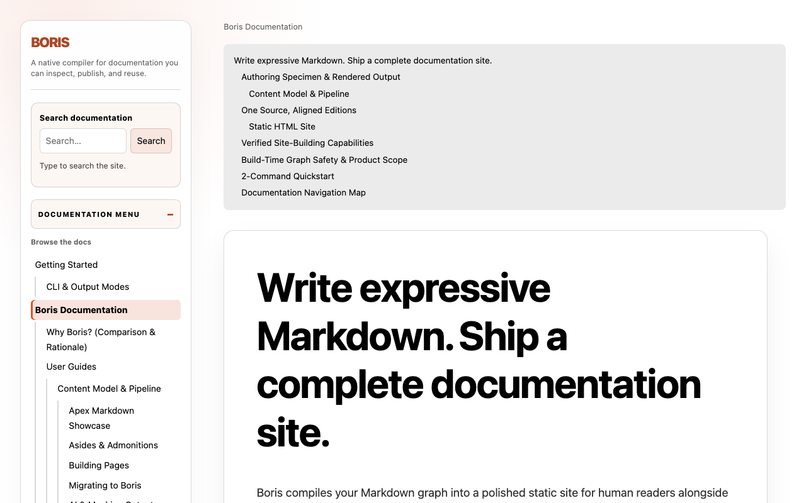
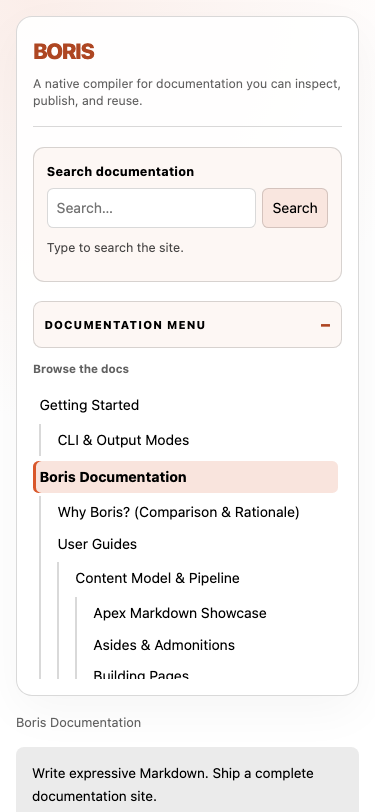
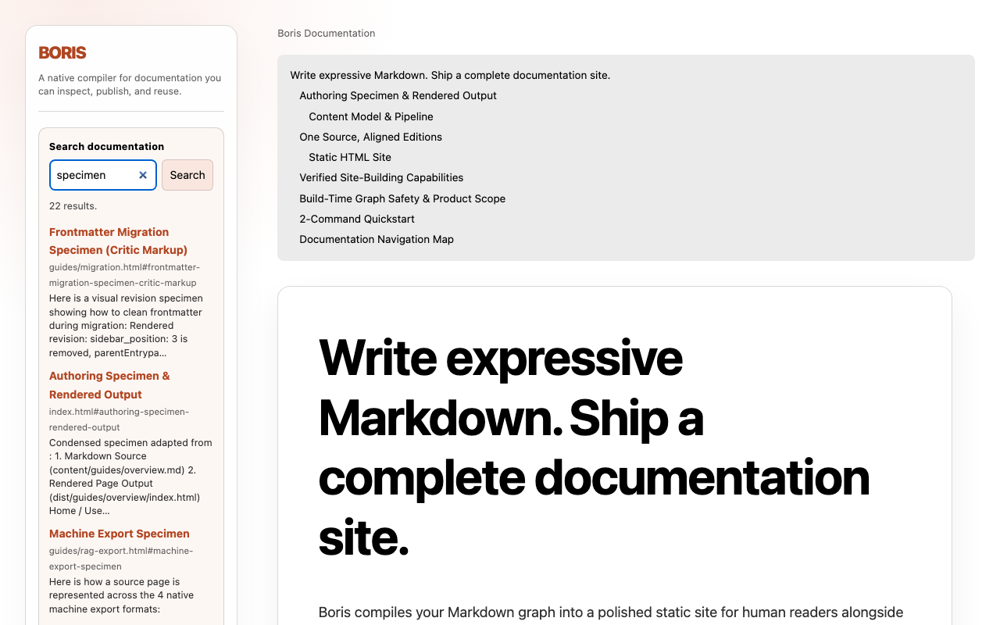

<p class="eyebrow">Publisher platform</p>

# One compiler. Many targets. One graph. {#one-compiler .hero-heading}

{{include includes/identity.md}}

<p class="home-actions">
<a href="getting-started.html">Get started</a>
<a href="guides/publishing.html">Publish</a>
<a href="guides/oliver-markdown.html">Watch Oliver work</a>
<a href="reference/commands.html">Open the reference</a>
</p>

<Aside kind="info" id="default-path">

The command you run first is still `boris --quiet`. That writes `dist/`.
Everything else on this site is an explicit target, projection, or annex —
named, linked, and fail-loud. Nothing here is a Node build step in a trench
coat.

</Aside>

## Why this exists {#why}

Most “documentation tools” are application frameworks that happen to eat
Markdown. Boris is the opposite: a **Zig compiler** that happens to publish
sites.

Local and static
: One native binary. Files you can inspect, archive, or serve. Node is not
  in the publication workflow. ~~npm install~~ is not a personality.

Graph-aware
: `parent` builds Trunk/Satellite hierarchy. Wiki-links and includes resolve
  against the frozen graph. Broken structure fails the build. The codes are
  exits, not vibes — see [[reference/diagnostics|Diagnostics]].

Closed on purpose
: Eight frontmatter keys. Two components. No YAML archaeology, no MDX
  runtime, no “whatever the plugin ate.” Exact rules live in the
  [[reference/frontmatter|frontmatter reference]].

One source, several honest exits
: HTML, GitHub Pages, Standard.site, IR, RAG, Context, `llms.txt`, RSS, and
  sitemap are **separate selections** over the same revision. Emitting one
  does not prove another.

In-process Markdown
: Page bodies are rendered by **Oliver** — pinned in `build.zig.zon`, called
  through `src/render.zig`, never a subprocess. This page is the argument.

---

## The product shape {#product-shape}

```text
Markdown + closed frontmatter
          │
          ▼
 discover → parse → validate/freeze the graph
          │
          ├── HTML publication          (default: dist/)
          ├── GitHub Pages              (verified target)
          ├── Standard.site / AT Proto  (verified target)
          ├── JSON IR / RAG / Context / llms.txt
          └── RSS 2.0, or an HTML sitemap when selected
```

| If you want… | That is… | Start here |
| :--- | :--- | :--- |
| A site on disk | Default target | [[getting-started|Getting Started]] |
| A hosted shop window | GitHub Pages | [[guides/publishing#github-pages|Publishing → Pages]] |
| Atmosphere records | Standard.site | [[guides/publishing#standard-site|Publishing → Standard.site]] |
| A compiler-backed editor | Product surface | [[guides/editor|Boris Editor]] |
| Machine packs | Projections | [[guides/rag-export|AI & Machine Outputs]] |
| The syntax this page is flexing | Oliver | [[guides/oliver-markdown|Markdown Showcase]] |

<div class="edition-grid">
<div class="edition-card"><span class="edition-card__tag">Default</span><h3>HTML <code>dist/</code></h3><p>The first command. Inspectable files. Any static host.</p></div>
<div class="edition-card"><span class="edition-card__tag">Target</span><h3>GitHub Pages</h3><p>Verified hosted shop window. Inventory-only upload.</p></div>
<div class="edition-card"><span class="edition-card__tag">Target</span><h3>Standard.site</h3><p>Atmosphere records. App password on bsky.social.</p></div>
<div class="edition-card"><span class="edition-card__tag">Projection</span><h3>IR / RAG / RSS</h3><p>Same frozen graph. Separate invocations. No silent merge.</p></div>
</div>

<Aside kind="tip" id="stranger-command">

A stranger reading only this page should run `zig build && boris --quiet`,
open `dist/index.html`, and come back. The rest of the registry waits.

</Aside>

<Details summary="Bookseller vs publisher — the identity we actually picked">

Issue [#538](https://github.com/drawmeanelephant/boris/issues/538) forced a
choice. We did **not** keep “documentation compiler, annexes in the
basement.” We did **not** split the editor into a second product.

We picked **publisher platform**: HTML `dist/` is the default target, not
the whole product. GitHub Pages and Standard.site are verified targets. The
editor, migration labs, and evidence chain are first-class surfaces of the
same compiler. Nostr is an open program. Cloudflare embedding is parked.

Living status: the repository [`docs/STATUS.md`](https://github.com/drawmeanelephant/boris/blob/afterparty/docs/STATUS.md)
file. Contracts still win if this page and a contract disagree.

</Details>

## What the default site actually looks like {#viewport-specimens}

Markdown images here are content-local. Boris rewrites them onto the published
sibling asset tree before Oliver sees the page.





## Oliver, used like we meant it {#oliver-flex}

This site is compiled by the compiler it documents. The following is not a
museum card. It is the body of this page.

### Headings with their own names {#headings-with-their-own-names}

The heading above carries an explicit id. The next one overrides the auto
slug on purpose:

### Custom gallery heading {#gallery-ial .showcase-heading}

That id is `gallery-ial`. Link it as
`[[index#gallery-ial|this exact heading]]` — [[index#gallery-ial|like this]].

### Inline craft {#inline-craft}

*italic*, **strong**, ***both***, `code`, and ~~the bookseller one-liner we
retired~~.

> Block quotes are still block quotes. They nest when you need them to.
>
> > Nested. Unimpressed. CommonMark.

A thematic break is three hyphens and a little dignity:

---

Autolink, because we can: https://github.com/drawmeanelephant/boris

### Lists that earn their indent {#lists}

- Write Markdown under `content/`
  - Closed frontmatter
  - Wiki-links to entity ids, not guessed `.html` paths
- Freeze the graph
  1. Discover
  2. Validate
  3. Render with Oliver
  4. Commit `dist/` — or refuse to

### A table with opinions {#opinions-table}

| Left-aligned fact | Centered status | Right-aligned exit |
| :--- | :---: | ---: |
| Default CLI | `dist/` | `0` |
| Broken `parent` | fail-loud | `1` |
| Unknown flag | usage | `2` |
| Disk said no | system | `3` |

### Definition list, because glossaries should look like glossaries {#glossary}

Trunk
: A page with no `parent`. A root of the navigation tree.

Satellite
: A page with exactly one direct `parent`. May itself have satellites.

Target
: A contracted publication destination. `dist/` is one. Pages is one.
  Standard.site is one. A wish is not.

Projection
: A machine or feed output from the same frozen graph. IR, RAG, Context,
  `llms.txt`, RSS. Not a second content model.

### Footnotes that stay out of the way {#footnotes}

Oliver renders footnote refs in document order and appends the section.[^fn-order]
The editor does not invent a second footnote grammar.[^fn-editor]

[^fn-order]: First-use order. The renderer collects definitions after the last reference.
[^fn-editor]: The Boris Editor is an interaction layer. Oliver remains the markup authority.

### Includes and wiki-links {#includes-and-wikis}

Reusable source fragments live under `content/includes/` and are **not**
pages:

{{include includes/shared-tip.md}}

{{include includes/publish-first.md}}

Cross-page graph links look like this: see
[[guides/building-pages|Building Pages]] and
[[reference/commands#exit-codes|the exit-code table]].

<Aside kind="warning" id="not-mdx">

`<Aside>` and `<Details>` are the only registered PascalCase components.
Unknown tags are errors. They do not nest. `> [!NOTE]` is a blockquote
with a costume, not a callout. `:::` is an export spelling, not an
authoring spelling.

</Aside>

<Details summary="What this page deliberately does not render">

Math (`$x$`), task-list checkboxes, fenced divs, critic markup, and
smart-quote rewriting are **not** Boris Markdown. If you type them, Oliver
keeps them as text. The compatibility wall is in
[[guides/oliver-markdown#what-is-not-rendered|the showcase]].

</Details>

## Choose a path {#choose}

| If you want to… | Start here |
|---|---|
| Build a first site | [[getting-started|Getting Started]] |
| Publish it somewhere real | [[guides/publishing|Publishing Targets]] |
| Create pages and links | [[guides/building-pages|Building Pages]] |
| Understand nested hierarchy | [[guides/trunk-satellite|Trunk & Satellite]] |
| Customize HTML and themes | [[guides/themes-and-layouts|Themes & Layouts]] |
| Use search in a rendered site | [[guides/search-and-ui|Search & Browser UI]] |
| Edit with the local editor | [[guides/editor|Boris Editor]] |
| Export machine-readable content | [[guides/rag-export|AI & Machine Outputs]] |
| Compare approaches | [[comparison|Why Boris?]] and [[technology-and-rationale|Technology & Rationale]] |
| Find exact flags and diagnostics | [[reference/commands|Command Reference]] and [[reference/diagnostics|Diagnostics]] |

<Aside kind="note" id="contracts-win">

This site is teaching. Contracts are law. If a sentence here and a file
under `docs/contracts/` disagree, the contract wins and this page should be
filed as a lie.

</Aside>
