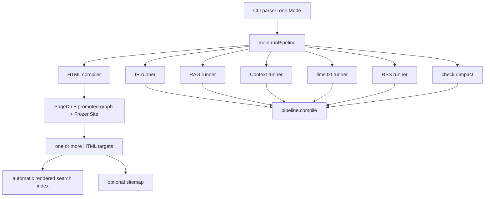

# Boris publication-surface audit

Status: repository audit, 2026-07-29

Audited integration revision: `afterparty` at `577eb21`

Product state described by the repository: v0.8.1 candidate; base IR schema
`0.2.0`

This audit records Boris's current publishing surface before a publication
profile is implemented. It does not make the proposal in
[`../design/publication-profile.md`](../design/publication-profile.md)
normative, and it does not change product behavior.

## Executive conclusion

Boris already has the outputs needed for a complete static publication, but it
does not yet have one publication command that coordinates them.

The current surface has two implementation families:

1. HTML, its automatic rendered-content search index, and optional sitemap are
   target-owned publication artifacts. HTML multi-target builds share one
   promoted page database and frozen site, and each target is staged and
   committed as a unit.
2. JSON IR, RAG, Context Bundle, llms.txt, and RSS are project-level,
   mutually-exclusive CLI modes. Each invokes the validated `pipeline.compile`
   path independently and publishes through its own staging boundary.

That split is more important than the superficial list of flags. Reusing one
`pipeline.Result` among the machine exporters is a bounded refactor. Treating
the HTML `FrozenSite` and the pipeline IR as interchangeable is not currently
supported by code or tests. A publication profile should coordinate the two
families first, preserve their existing contracts, and require equivalence
tests before deeper graph unification.

The smallest durable design is an explicitly selected, strict JSON project
manifest that normalizes to the same target and layout-rule model as the CLI.
It can hold site metadata once, name one public HTML target, place RSS and
sitemap inside that target, and opt into project-level machine editions. Bare
and legacy single-mode invocations should remain byte-for-byte compatible.

## Scope and evidence method

The audit followed the repository evidence order:

1. current executable behavior and implementation;
2. canonical files under `docs/contracts/`;
3. `AGENTS.md`;
4. `docs/STATUS.md` and `CHANGELOG.md`;
5. build and release-gate definitions;
6. README and public `content/`.

Primary implementation paths inspected:

- `src/cli.zig` and `src/main.zig`;
- `src/compile.zig`, `src/search_index.zig`, `src/rss.zig`, and
  `src/sitemap.zig`;
- `src/pipeline.zig`, `src/json_out.zig`, `src/rag.zig`,
  `src/context.zig`, and `src/llms.zig`;
- target, layout, theme, staging, and path validation code reached from those
  modules;
- `build.zig`, `scripts/release-gate.sh`, module tests, fixtures, and focused
  test steps;
- all publication-related contracts;
- README, `docs/STATUS.md`, theme layouts, and the complete `content/` tree.

The checked-in default theme was included because it determines whether a
generated artifact is visible to a reader. Generated directories such as
`dist/`, `rag/`, and `source-rag/` were not treated as source truth.

## Current execution topology



The diagram describes implementation reuse, not an artifact dependency. Search
indexes rendered HTML. Sitemap uses the staged/live HTML-page overlay. RSS and
the machine editions compile the content graph independently in their current
standalone modes.

## Capability matrix

Classification vocabulary in this matrix:

- **core**: the default human publication;
- **automatic**: emitted as part of another selected publication;
- **opt-in**: supported product output selected explicitly;
- **lab-only**: maintained outside the product compiler;
- **deferred**: documented direction without a shipped product output.

| Output or capability | Class | Required metadata | Current CLI entry point | Current output path | With HTML in one invocation? |
|---|---|---|---|---|---|
| HTML site | Core | content metadata; layout/theme paths; target name/path when non-default | bare `boris`, `build`, `--html`, `--html-dir`, or repeated `--target` | `dist/` by default, or each target root | Yes; it is the owning mode |
| Rendered-content search index | Automatic | successfully rendered, non-empty HTML; compiler builds use the target's complete live-page overlay | automatic in HTML; standalone tool has its own CLI | `<target>/_boris/search/search-index.json` | Yes, automatically for every HTML target |
| XML sitemap | Opt-in HTML artifact | absolute HTTP(S) `--site-url`; optional target-relative path | `--sitemap [--sitemap-path PATH] --site-url URL` in HTML mode | `<target>/sitemap.xml` by default | Yes, for exactly one HTML target |
| JSON IR | Opt-in machine edition | content/frontmatter only | `--no-rag` or `--out DIR` | `.boris/{manifest,graph,build-report}.json` by default | No |
| RAG corpus | Opt-in machine edition | content/frontmatter; optional scope/split controls; checked-in system seeds | `--rag`, `--rag-dir`, `--scope`, `--split-size`, `--bundles-only` | `rag/` by default | No |
| Context Bundle | Opt-in machine edition | content/frontmatter; optional scope/split controls | `--context`, `--context-dir`, `--scope`, `--split-size` | `context/` by default | No |
| llms.txt | Opt-in machine edition | content/frontmatter; no deployment metadata accepted | `--llms [--llms-path PATH]` | repository-relative `llms.txt` by default | No |
| RSS 2.0 | Opt-in publication output | channel site URL, title, description; item `published_at` and `summary`; optional limit | `--rss`, `--rss-path`, `--site-url`, `--rss-title`, `--rss-description`, `--rss-limit` | repository-relative `rss.xml` by default | No |
| Multi-target HTML | Opt-in build capability | target name/output; optional target layout and canonical layout rules | repeated `--target`, `--target-layout`, and `--layout-rule` | isolated target roots and cache namespaces | Yes; targets share HTML discovery and graph freeze |
| `check` and `impact` | Analysis, not publication | content/frontmatter; optional output format/report path | `check`; `impact <ID>` | stdout or explicit report only | No; read-only and rejected with build selectors |
| Migration labs | Lab-only | lab-specific fixture/input | separate `tools/migration-lab` build roots | lab-local outputs | No; deliberately outside the product compiler |
| Source-code RAG pack | Developer tool, not a publication edition | repository source | `zig build source-rag` | gitignored `source-rag/` | No; distinct from product RAG |
| Sitemap index, `robots.txt`, feed discovery injection, remote deploy | Deferred | Not defined | None | None | No |

### Contracts, tests, and limitations by output

| Output | Normative contract and test evidence | Known limitations |
|---|---|---|
| HTML | `html-output.md`, `templating-and-themes.md`, `multi-target-isolated-output.md`; extensive `src/compile.zig` unit/integration tests; aggregate `zig build test`; HTML release-gate smoke | Uses the HTML `PageDb`/`FrozenSite` path rather than `pipeline.Result`; target commits are isolated rather than one all-target transaction; watch remains HTML-focused |
| Search | `rendered-search.md`; `src/search_index.zig` tests; compile integration test `HTML publish produces search from live overlay and removes stale pages` | Fixed target-relative path and schema; indexes rendered body text rather than graph/Markdown; a custom theme can omit the search UI even though the artifact exists |
| Sitemap | `xml-sitemap.md`; `src/sitemap.zig` tests; compile rollback, draft, collision, incremental, worker-determinism, and limit tests; `zig build test-sitemap` | One target only; only `<loc>` entries; no sitemap index, gzip, `lastmod`, `changefreq`, `priority`, or `robots.txt`; no automatic layout hint |
| JSON IR | `ir-schema.md` and graph/frontmatter contracts; pipeline tests; `zig build test-ir-schema`; release-gate golden checks | Separate CLI mode; not an HTML render model; schema 0.2/0.3 selection is semantic-feature dependent |
| RAG | `rag-export.md`; `src/rag.zig` deterministic, scoped, split, provenance, and failure tests; dual-run release-gate comparison | Separate mode and graph compile; system-seed source is the repository `docs/rag/system/` tree; no upload or network behavior |
| Context | `context-bundle.md`; `src/context.zig` scoped/split/full-graph tests; dual-run release-gate comparison | Separate mode and graph compile; no shared publication transaction with RAG, IR, or HTML |
| llms.txt | `llms-txt.md`; `src/llms.zig` summary test; CLI conflict tests; aggregate suite | Fixed `# Boris documentation` heading and root-relative `/<id>/` links; site metadata cannot currently alter bytes; `llms-full.txt` and deployment-aware URLs are deferred |
| RSS | `rss-2.0.md`; `src/rss.zig` validation/render/order tests; CLI metadata/conflict tests; aggregate suite | Separate mode and repository-relative path; eligible items require both `published_at` and `summary`; no theme discovery link; no Atom/JSON Feed, enclosures, categories, or HTML body |
| Multi-target | `multi-target-isolated-output.md`, `templating-and-themes.md`; canonicalization, collision, cache, theme, and worker tests in CLI/compile modules | One theme root per target; sequential target commits; sitemap cannot select among multiple deployment URLs |
| Analysis | `analysis-commands.md`; module/CLI tests; release gate checks that no publication artifacts are created | Does not reuse an already-running publication plan because no such plan exists; this is a boundary to preserve, not a missing output |
| Migration labs | migration-lab contracts and the standalone lab build/test surface | Explicitly non-product and not covered by the root product executable |

Passing a contract is not inferred merely from its existence. The evidence
column names executable or test paths that exercise the relevant behavior.
Conversely, the absence of a dedicated release-gate subsection is not treated
as absence of aggregate test coverage.

## Metadata ownership

Current deployment metadata is attached to one output mode:

| Metadata | Current consumer | Current source | Not currently consumed by |
|---|---|---|---|
| Site URL | RSS channel/item URLs; sitemap `<loc>` values | `--site-url` | HTML layouts, search, IR, RAG, Context, llms.txt |
| Site title | RSS channel title | `--rss-title` | HTML site chrome and llms.txt |
| Site description | RSS channel description | `--rss-description` | HTML metadata and llms.txt |
| RSS limit | RSS item selection | `--rss-limit`, default 20 | Other outputs |
| HTML title/description | Individual page frontmatter and layout rendering | page metadata/layout | RSS channel metadata |

`--site-url` is shared syntactically by RSS and sitemap, but the CLI makes those
modes mutually exclusive. The value therefore cannot coordinate the two in one
invocation. Channel title and description are RSS-specific flags even though
they are publication-level concepts.

The checked-in default theme has no configuration hook for the deployment URL
or publication description. Adding a profile must not silently rewrite page
metadata or make HTML depend on RSS fields.

## Duplication and friction

### Repeated or output-local site metadata

RSS requires URL, title, and description. Sitemap separately requires the same
URL concept. No project artifact records that metadata once, so release scripts
must repeat it and keep it aligned. llms.txt cannot consume it at all under its
current contract.

Classification: **Documented limitation**. The behavior is explicit in
`cli.md`, `rss-2.0.md`, and `xml-sitemap.md`.

### Mutually exclusive output modes

`cli.Options.mode` is one enum value. `main.runPipeline` switches once, and the
parser rejects combinations among HTML, IR, RAG, Context, llms.txt, and RSS.
Sitemap is the one composable selector, but only because it is implemented
inside HTML mode. Search is automatic inside HTML rather than a mode.

Classification: **Documented limitation**. The CLI help and contract describe
the conflicts, and a black-box HTML-plus-RSS invocation exits 2.

Impact: a complete publication requires multiple invocations, recompiles, and
separate commit boundaries. A source change between invocations can produce
editions from different revisions unless the caller supplies external
serialization.

### Output path models

Three path ownership models coexist:

1. HTML, search, and sitemap are target-root relative.
2. IR, RAG, and Context use repository-relative output directories.
3. llms.txt and RSS use repository-relative file paths, even when a deployer
   intends to place them beside HTML.

Each standalone exporter validates workspace containment and source overlap,
but there is no canonical cross-output plan that can reject every collision
before the first publisher writes. HTML has stronger internal collision checks
among pages, assets, search, cache, and sitemap.

Classification: **Documented limitation**. The separate paths are contractually
defined, but their composition is external to Boris.

### Graph compilation and safe reuse boundary

IR, RAG, Context, llms.txt, and RSS each call `pipeline.compile`. Their rendering
and publishing steps can be refactored to accept one borrowed, immutable
`pipeline.Result` without changing artifact schemas.

HTML does not call that pipeline. It loads and promotes a `PageDb`, freezes an
HTML-oriented graph, resolves layouts/includes, renders Apex, and creates a
staged/live overlay for target artifacts. Multi-target HTML already reuses this
work safely within one invocation.

Classification: **Documented limitation** for current duplicate compilation.
It would be **insufficient evidence** to claim that the two graph
representations can simply be replaced by one another. The repository has no
full equivalence test proving identical node inclusion, ordering, diagnostics,
relations, include dependencies, and role promotion across both paths.

### RSS and sitemap discovery in themes

The default theme contains the browser search UI and fetches the fixed search
index path. It does not receive a feed URL or emit
`<link rel="alternate" type="application/rss+xml">`. Sitemap similarly has no
theme-visible discovery hint. README instructs the operator to add the RSS link
after publishing.

Classification: **Documented limitation**. Artifact production works without
theme discovery, but the default public experience does not advertise feeds to
readers or clients.

### Publication versus analysis

`check` and `impact` compile enough graph state to answer questions, but their
CLI grammar rejects publication selectors and the release gate checks that
they create no product artifacts. Migration labs and source-RAG are separate
tools with separate intent.

Classification: **Non-issue / packet drift prevention**. Sharing parsing or
graph code does not make these publication outputs. A profile must not blur
that boundary or make analysis commands execute output entries.

## Material findings and remediation cards

The following are findings under the repository review taxonomy. Architectural
friction already documented above is not relabeled as a defect.

| Severity | Classification | Exact locus | Evidence and impact | Smallest remediation card | Verification |
|---|---|---|---|---|---|
| P2 | Confirmed defect | `content/index.md`, `content/getting-started.md`, `content/guides/building-pages.md`, `content/guides/overview.md`, `content/reference/outputs.md`, and `content/guides/rag-export.md` | These pages say rendered search must be generated by the standalone tool or that HTML does not emit it. `compile.zig` always writes the target search overlay, the contract says it is compiler-owned, and a current HTML smoke produced 22 search documents. Readers are told to run an obsolete extra step and may diagnose a missing index incorrectly. | Later content-only pass: make automatic compiler search the primary path; retain the standalone producer only as a specialized compatibility/tooling note; cross-link `guides/search-and-ui.md`. | `zig build test`; build `content/`; assert `<target>/_boris/search/search-index.json`; search public prose for the obsolete claim |
| P2 | Confirmed defect | Public statements that Boris accepts exactly five frontmatter keys, especially `content/reference/frontmatter.md`, plus `content/index.md`, `content/getting-started.md`, and related guides | `frontmatter.md` normatively permits eight keys: `id`, `title`, `parent`, `status`, `tags`, `relations`, `published_at`, and `summary`; status also includes `archived`. The public reference omits the fields that power semantic relations and RSS. | Later content-only pass: update the canonical public reference first, then replace duplicated five-key claims with links to it. State output-specific draft behavior rather than one global exclusion rule. | `zig build test`; contract fixture coverage; repository text search for “five keys” and incomplete key lists |
| P2 | Confirmed defect | Public draft semantics in `content/reference/frontmatter.md` and duplicated overview prose | Public prose says drafts are excluded from all outputs. Current contracts and tests exclude drafts from RSS and sitemap, while graph/IR representations retain draft entities; the HTML and machine-export paths do not establish the claimed universal exclusion. This can cause authors to publish or inspect a different surface than expected. | Later content-only pass: add an output-by-output status table based on contracts; do not change compiler behavior as a documentation fix. | Fixture containing draft/published/archived pages across HTML, IR, RAG, Context, llms.txt, RSS, and sitemap |
| P3 | Documented limitation | `src/llms.zig` and `docs/contracts/llms-txt.md` | llms.txt uses a fixed Boris heading and `/<id>/` links; it accepts no publication metadata. A future profile cannot honestly claim site-aware llms.txt merely by coordinating the existing exporter. | Keep v1 profile coordination byte-preserving. Amend the llms contract in a later slice before using profile title/base URL or target route mapping. | Existing golden output plus new legacy-versus-profile byte comparison |
| P3 | Documented limitation | `scripts/release-gate.sh` compared with the full publication matrix | Aggregate tests cover RSS/llms/search/sitemap modules, and sitemap has a focused build step, but the release script's black-box artifact sections emphasize HTML, IR, RAG, and Context. A single all-publication profile smoke does not exist because the capability does not yet exist. | When the profile ships, add one deterministic full-profile smoke and prior-output-preservation failure case. Keep focused module steps available so aggregate failure does not mask the locus. | `zig build test`; `zig build test-sitemap`; new profile release-gate section |

No product-code fix is part of this audit. The confirmed defects are public
documentation defects and belong in a deliberate content pass so the public
site stays coherent.

## Current black-box evidence

The audit built the current executable and ran the same `content/` source
through every product output in isolated temporary paths. Results:

| Check | Result |
|---|---|
| HTML | PASS |
| automatic search | PASS, 22 documents |
| sitemap | PASS, 22 URLs |
| JSON IR | PASS, 22 pages |
| RAG | PASS |
| Context Bundle | PASS |
| llms.txt | PASS |
| RSS | PASS, 0 items |
| attempted combined HTML + RSS | expected usage failure, exit 2 |

Zero RSS items is consistent with the current source: `content/` has no
`published_at`/`summary` pairs. It is evidence of a dogfood gap, not an RSS
emitter failure.

An initially stale `zig-out/bin/boris` did not show the sitemap flags even
though source and tests contained them. Rebuilding with the current source
resolved the mismatch. Classification: **Non-issue / build-state drift**, not a
product defect.

Commands and outcomes captured during the audit:

```text
git status --short --branch
  PASS; unrelated untracked Instagram export and pr-272-agent-kit/ preserved

zig build test
  PASS

zig build
  ENVIRONMENT FAILURE: Zig global cache under ~/.cache was denied by sandbox

ZIG_GLOBAL_CACHE_DIR=.zig-cache/global zig build
  PASS

ZIG_GLOBAL_CACHE_DIR=.zig-cache/global zig build test
  PASS; all 63 source modules classified; emitter discipline passed

ZIG_GLOBAL_CACHE_DIR=.zig-cache/global zig build test-sitemap
  PASS

ZIG_GLOBAL_CACHE_DIR=.zig-cache/global zig build test-apex-hostile
  PASS

ZIG_GLOBAL_CACHE_DIR=.zig-cache/global zig build test-apex-sanitize
  PASS; ASan+UBSan smoke ran and reported apex_sanitize_smoke: ok

isolated current-binary publication smoke over content/
  PASS for HTML/search/sitemap/IR/RAG/Context/llms/RSS
  search_documents=22 sitemap_urls=22 rss_items=0 ir_pages=22
  composite_html_rss_exit=2

ZIG_GLOBAL_CACHE_DIR=.zig-cache/global ./scripts/release-gate.sh
  PASS; RELEASE GATE PASSED, including dual-run RAG and Context determinism,
  IR goldens, HTML/layout/analysis/Textile/graph fixtures, and review packaging

git diff --check
  PASS
```

## Content and positioning implications

The `content/` directory is Boris's public product explanation, not a fixture
collection. It already demonstrates meaningful parts of the product, but its
information architecture still reflects an earlier “HTML compiler plus
separate tools” phase more than the current publication surface.

### Statements that remain accurate

- Boris is a Zig-native, offline, deterministic static publication compiler;
  it has no Node or JavaScript application runtime.
- Expressive Markdown is parsed by the in-process Apex integration, and the
  public examples visibly exercise tables, task lists, footnotes, definitions,
  Critic Markup, raw HTML, semantic asides, includes, and wiki-style links.
- Trunk/satellite hierarchy, parent navigation, relations, breadcrumbs, and
  graph validation are core concepts.
- Bare `boris` builds HTML, while current machine editions remain selectable by
  existing CLI flags.
- Themes, layout rules, isolated target roots, and bounded HTML workers are
  supported without a client framework.
- `check` and `impact` are read-only analysis commands, and migration labs are
  separate from the product compiler.
- One content source can produce human and machine-oriented editions. Until a
  coordinator exists, this means editions built from the same source revision,
  not necessarily one shared in-memory graph or transaction.

### Statements that need revision

- The pages named in the first confirmed finding must stop presenting the
  standalone rendered-search tool as a required post-HTML step.
- “Exactly five frontmatter keys” must become the normative eight-key model,
  including `relations`, `published_at`, `summary`, and `archived`.
- Claims that drafts are excluded universally must be replaced by
  output-specific behavior supported by contracts and tests.
- References and command maps that omit RSS and sitemap currently understate
  the shipped CLI.
- After a publication profile ships, prose saying that all machine exports are
  necessarily separate mutually-exclusive modes will remain true only for the
  compatibility CLI, not the recommended project workflow.
- After a profile ships, repeated examples supplying RSS title, description,
  and site URL on every command should become legacy/override examples.
- “Same graph” should be used carefully until HTML/pipeline equivalence or
  unification is a tested invariant.

### Missing concepts that should be introduced

- a complete publication as a named set of human and machine editions;
- one public target with deployment URL, title, and description;
- target-owned artifacts (HTML, search, RSS, sitemap, and deploy-facing
  llms.txt under the proposal) versus project-level machine editions (IR, RAG,
  and Context);
- the distinction between publication, read-only analysis, and migration labs;
- deterministic profile normalization, CLI override precedence, and offline
  behavior;
- explicit status behavior by output;
- feed eligibility and publication metadata for authored pages.

### Pages likely to require changes

Primary pages:

- `content/index.md`;
- `content/getting-started.md`;
- `content/reference/frontmatter.md`;
- `content/reference/outputs.md`;
- `content/reference/commands.md`;
- `content/guides/search-and-ui.md`;
- `content/guides/themes-and-layouts.md`;
- `content/guides/rag-export.md`.

Secondary consistency pass:

- `content/guides/building-pages.md`;
- `content/guides/overview.md`;
- `content/guides/migration.md`;
- `content/reference/diagnostics.md`;
- comparison and technical-rationale pages that duplicate key counts or search
  workflow claims.

README should receive only focused edits after implementation: profile quick
start, legacy compatibility note, and corrected feed-discovery guidance. A
wholesale README rewrite is neither required nor recommended.

### Capabilities that need better dogfood demonstrations

- RSS: no public page currently supplies the `published_at`/`summary` pair, so
  Boris's own feed is empty.
- Sitemap: shipped and tested, but not visible in the public reference or site
  navigation.
- Search: the default theme visibly implements it, while several prose pages
  still describe the old standalone workflow.
- Machine editions: IR, RAG, Context, and llms.txt are documented separately
  but not shown as one aligned publication set.
- Multi-target publishing: the guide explains it, but the public artifact
  cannot visibly demonstrate two target outputs from inside one target.
- Themes: layout selection is documented, but a small public example showing a
  page-level rule outcome would make the capability concrete.
- Graph structure: navigation demonstrates hierarchy; a compact relations and
  impact example would better expose the graph-native value.

### Recommendations for a later content pass

1. Repair the confirmed search, frontmatter, and draft-semantics defects before
   introducing new profile prose.
2. Add one “Publish a complete site” journey that starts with expressive
   Markdown, runs the profile once, and inventories human and machine artifacts.
3. Make `reference/frontmatter.md` the single public key/status authority and
   link to it instead of duplicating closed lists across guides.
4. Add publication metadata to a small set of suitable pages so the repository
   dogfoods a useful RSS feed without pretending every documentation edit is a
   dated article.
5. Add a publication-output matrix derived from the normative contracts, with
   status inclusion, path ownership, and profile/legacy invocation columns.
6. Show search, sitemap, RSS, machine editions, themes, and targets as parts of
   the publication compiler while keeping analysis commands and migration labs
   in clearly separate navigation groups.
7. Update public claims only after the corresponding profile contract and tests
   land; keep proposal-only syntax under `docs/` until then.
