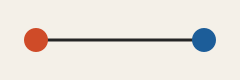

# Kickoff field note



## Audit surface

| Surface | Expected posture |
|---|---|
| Child list | direct, deterministic, and linkable |
| Asset | published beside this page's output path |

<Aside kind="tip" id="archive-tip">

This is an in-page Aside, not a separate archive record.

</Aside>

<Details summary="Why is the graph deliberately flat?" id="flat-graph" open="true">

The nested source directory is an identity path. The graph remains one parent
edge from this Satellite to `years/2024`.

</Details>

## Copyable evidence

```text
archive audit: deterministic
```
