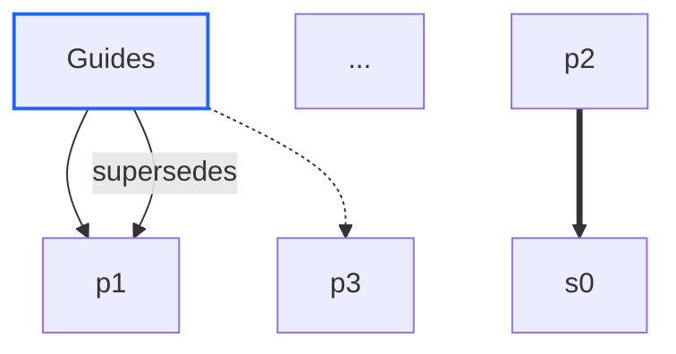
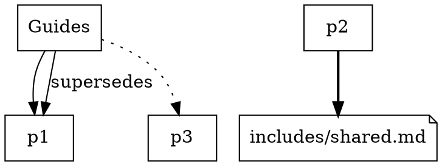

# Graph render formats (`boris graph`)

**Status:** implemented first slice — `--format mermaid` and `--format dot`.
Normative for `boris graph`.

`boris graph` is a read-only projection of the already validated, frozen
content graph. It consumes the same `pipeline.compile` result as `check` /
`impact` and renders its nodes and dependency edges. It never resolves parents,
re-parses frontmatter, or invents edges, so the document cannot disagree with
the committed `graph.json` topology.

## CLI

```text
boris graph [--input DIR] [--format mermaid|dot] [--out PATH]
```

| Flag | Behavior |
|------|----------|
| `--input DIR` | Content root (default `content`), the same selection as `check` / `impact` |
| `--format mermaid\|dot` | Render target; default `mermaid`; any other value is usage exit 2 |
| `--out PATH` | Write the single-file document to `PATH` instead of stdout |
| `--textile` / `--cooklang` | Whole-tree source adapter, as on `check` / `impact` |
| `--quiet` | Suppress progress and success stderr; errors always print |

Exactly one destination is written: `PATH` when `--out` is given, stdout
otherwise. stdout carries the document and nothing else; diagnostics and errors
stay on stderr. Exit classes follow `check` / `impact`:

| Code | Meaning |
|-----:|---------|
| `0` | Valid frozen graph; document written |
| `1` | Content or graph failure (existing diagnostics, no document) |
| `2` | Usage error: unknown flag, bad `--format`, conflicting mode |
| `3` | I/O or system failure |

Every projection, HTML, analysis-report, or watch selector is a conflict
because it would either execute another path or corrupt the document stream:
`--report`, `--timings`, `--fail-on-unreferenced`, `--rag`, `--context`,
`--llms`, `--rss`, `--sitemap`, `--no-rag`, `--target`, `--html`,
`--html-dir`, `--theme`, `--layout-rule`, `--watch`, `--jobs`,
`--incremental`, `--scope`, and the Pages/RSS channel flags. `--out` is
re-owned as the render path (as it is on `recipe-scale`) and never selects IR
mode. `--out` is a single explicit file, not an output tree, so the workspace
containment rule that governs output trees does not apply to it; it may be
written anywhere the process may write, like `--report`.

## Documents

### Mermaid (`--format mermaid`, default)



Renders inside GitHub, Notion, and the Mermaid live editor with no runtime
dependency. The fixed header comment names the command; nothing else in the
document is process- or host-dependent.

### Graphviz DOT (`--format dot`)



`class` values (`trunk`, `satellite`, `source`) are SVG styling hooks for
consumers; Boris ships no stylesheet. Rasterizing requires a local `dot`
binary — that is the consumer's choice, never a Boris dependency.

## Alias and label model

Pages keep their frozen index: `p0..pN` in id-sorted frozen node order.
`source` endpoints (include targets that are not page nodes) do not appear in
`nodes`; they are aliased `s0..sM` in unsigned-byte order of their canonical
path. Labels are the page `title` when non-empty, else the entity `id`; a
source label is its canonical path.

Labels are escaped for the container by `encode.zig`, through
`structured_out.Sink`:

- `mermaid_label` neutralizes `#`, `"`, `&`, `<`, and `>` (Mermaid decodes
  `#NNN;` references and interprets label markup) and flattens every line
  terminator to a space.
- `dot_label` escapes `\` and `"` and flattens every line terminator to a
  space.

## Edges

| Frozen edge `kind` | Diagram direction | Mermaid | DOT |
|---|---|---|---|
| `parent` | parent → child (the authored edge is the satellite's dependency on its parent; the diagram draws the hierarchy) | `-->` | solid |
| `include` | consumer → source endpoint | `==>` | `[style=bold]` |
| `reference` | page or source → page | `-.->` | `[style=dotted]` |
| semantic relation | source page → target page, kind as label | `-->\|kind\|` | `[label="kind"]` |

Dependency edges follow the canonical frozen edge order. Semantic relations
are emitted after them, sorted by source entity, target entity, then kind
(index order is id order, so this matches the IR `relations` ordering).

## Determinism

The document is byte-identical for the same frozen graph on one host. No
timestamps, source file names, absolute paths, or hash-map iteration enter it;
alias order is derived from the frozen node order and byte-sorted source
paths. A graph that fails validation publishes no document at all.

## Non-goals

- No interactive or HTML render; the Boris Editor's graph pane is the
  interactive surface. No CDN script and no vendored layout library in the
  compiler binary.
- No node sizing by content weight in this slice.
- No IR, schema, or `graph.json` change; this is a projection, not a rewrite.
- No graph repair or partial fallback: an invalid graph fails before render.

## Fixtures

The [documentation-intelligence fixture](fixtures/documentation-intelligence/README.md)
pins both renders of its acceptance tree in `expected/graph.mmd` and
`expected/graph.dot`, and its integration test re-renders them in-process.
