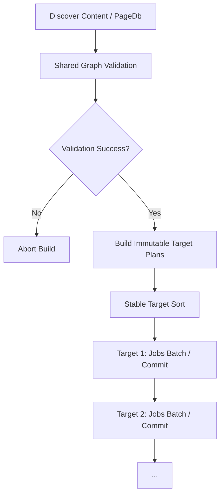

# Multi-Target Isolated Output & Cache Namespaces Contract (P3.3 / P4 ergonomics)

**Status:** normative contract  
**Version:** Boris/0.6.1 · IR schema 0.2.0

This document specifies the CLI grammar, target validation, structural cache isolation, scheduling, and error boundaries for multi-target HTML site generation in Boris.

---

## 1. CLI target grammar & options

To support multiple explicitly named HTML build targets, we introduce a repeatable `--target` flag of the format:
```text
--target <NAME>=<OUTPUT_DIR>
```

Layout selection:
```text
--html-layout <PATH>           # global default (default: layouts/main.html)
--target-layout <NAME>=<PATH>  # per-target override (NAME must match a --target or "default")
--layout-rule <TARGET> <SELECTOR> <LAYOUT_PATH>  # repeatable page layout rules (HTML only)
```

### Constraints & Conflict Rules:
1. **Implies HTML mode:** Providing `--target` or `--target-layout` automatically sets the build mode to `.html`.
2. **Bare HTML / default target:** If no `--target` is specified, Boris synthesizes a single target named `"default"` with output directory `--html-dir` when provided, otherwise `"dist"`. This applies to bare `boris`, `--html`, and `--html-dir`.
3. **Mutual Exclusivity:**
   - `--target` cannot be combined with `--html-dir`, since targets explicitly define their own output directories.
   - `--target` is mutually exclusive with `--out`, `--rag`, and `--rag-dir`.
4. **Permitted Combinations:** `--html` is allowed alongside `--target` to explicitly declare HTML mode, but is redundant. `--html-layout` and `--target-layout` are HTML-only. `--target` may be combined with `--watch`, `--incremental`, and `--jobs` (global to all targets; `--watch` implies incremental).
5. **Global options:** `--watch`, `--incremental`, and `--jobs` apply globally to all targets.

### Argument-order independence:
1. **`--target` order:** Multiple `--target` flags may appear in any order. After parse, `Options.targets` is sorted alphabetically by target name. Equivalent permutations produce equivalent configuration.
2. **`--target-layout` order:** Layout overrides may appear before or after the matching `--target` (and relative to other flags). They are collected during parse and applied after targets (including the synthetic `"default"` target) are known.
3. **Canonical configuration:** Name, output directory, and effective layout for each target are order-independent. Duplicate target names and duplicate `--target-layout` names for the same target are rejected.

---

## 2. Target validation rules

Before starting any source discovery, page rendering, cache mutation, cleanup, or publication, Boris validates all targets. Any validation failure causes Boris to exit immediately with a usage error (exit code `2`).

### Target Name Rules:
- Non-empty alphanumeric string containing only letters, numbers, `-`, `_`, and `.`.
- Must not be `.` or `..`.

### Path Overlap & Safety Rules:
To guarantee absolute directory isolation, we resolve all target output directories to absolute paths relative to the current working directory (lexically resolving `.` and `..` segments, normalizing separators to `/`, stripping a trailing `/`, and preserving letter-case matching semantics of the target platform).
We enforce:
1. **Unique Target Names:** Duplicate target names are strictly rejected (`error.DuplicateTargetName`).
2. **No Output Root Overlap:**
   - Absolute path equality is rejected (`error.TargetOutputCollision`).
   - Parent/child nesting collisions are rejected (`error.TargetOutputCollision`). A path $A$ is a parent of $B$ if $B$ equals $A$ or is $A$ followed by a path separator (path-boundary prefix; sibling prefixes such as `dist` vs `dist-prod` are allowed).
   - Output paths must not escape the workspace. Workspace membership is also path-boundary prefix (rejects sibling false positives such as `/ws` vs `/ws-evil`).
   - Targeting the workspace root itself is rejected (`error.TargetOutputCollision`).
3. **No Content / Layout Overlap:** Target output roots must not equal or nest with the resolved `--input` content root, the resolved layout file path, or the layout file’s parent directory when that parent is not the workspace root (`error.TargetOutputCollision`). This prevents writing HTML into the source tree and prevents watch mode from ignoring content edits.
4. **No Symlinks as Target Roots:** Target output paths must not be or pass through a symlink component. Boris walks progressive relative path components of each target `output_dir` and rejects any existing symlink (`error.TargetOutputSymlink`). Absolute / drive-letter forms that cannot be stated relative to cwd are still subject to resolved workspace membership checks.
5. **Validation failures are usage errors:** Any of the above validation failures must abort before discovery/render and map to process exit code **2**. CLI parse failures for target grammar (invalid name, missing `=`, unknown `--target-layout` name, `--target` with `--html-dir`) also exit **2**.

### Diagnostics:
- On configuration failure, diagnostics report the error name and list configured targets in **canonical name order** with effective `out=` and `layout=` paths.
- On multi-target success (non-quiet), progress output lists the same canonical order and effective paths.
- Execution, staging, and failure messages that name targets use the same sorted order.

---

## 3. Structural cache & configuration isolation

Cache isolation is strictly structural. Each target has its cache namespace and manifest isolated under its output directory:

```text
<target output root>/
  .boris-cache/
    manifest.json
```

### Configuration Identity Hashing:
Every page fingerprint hashes a stable **Target Configuration Identity**. The fingerprint includes:
- Cache-format/version discriminator (e.g., `boris-cache-v2-layout-rules`)
- Target configuration digest, including:
  - Target name / stable namespace string
  - Global/target-specific layout path and layout template bytes/fingerprint
  - Target-specific options (if any) that affect emitted bytes
- Normalized page identity (`entity_id`)
- Source page file bytes
- Transitive include dependency bytes (sorted alphabetically)

This ensures that:
- Target A's stale cleanup only enumerates and removes files beneath Target A's root.
- Target A's staging/temp files cannot collide with Target B's.
- Target A's cache manifest cannot be read or overwritten by Target B.
- Accidental cache hits cannot leak across targets if their configuration, layouts, or settings differ.
- Old or pre-P3 cache directories (lacking a matching configuration/format discriminator) are safely invalidated, triggering a clean cold rebuild.
- On-disk `manifest.json` `format_version` must equal the fingerprint discriminator (currently `boris-cache-v2-layout-rules`). Manifests with any other version string are ignored (cold rebuild for that target).

---

## 4. Shared vs. isolated state & scheduler model



### Explicit First-Slice Target Semantics:

| Area | Rule |
|---|---|
| Content roots | One shared `--input` content root |
| Graph/parser | Discover, parse, validate, and freeze once per invocation |
| Layout | Global `--html-layout` default; optional per-target `--target-layout`; optional `--layout-rule` table (exact/glob/role). Declared layouts cached by path; selection is per target/page. |
| Fingerprint inputs | Source + include graph prepared once; effective selected layout path/bytes applied per page |
| Generated output as input | Forbidden; target output trees are never dependency roots |
| Cross-target dependencies | Forbidden |
| Target order | Sorted alphabetically by canonical target name before execution / commit; CLI parse stores the same order |
| Legacy / bare mode | Bare CLI, `--html`, and `--html-dir` map to `default` target |
| Target mode | `--target NAME=DIR` implies HTML mode |
| Cache | Target-owned cache namespace and manifest |
| Staging / commit | Dirty pages + incremental manifest write under sibling `{dist}.boris-stage`; rename-commit into final only after full target success; discard stage on failure |
| Watch | Content changes rebuild all targets; layout-file changes rebuild only targets using that layout; ignore finals + `.boris-stage` |

### Failure Policy:
1. **Validate All Targets First:** Before source discovery, rendering, cache mutation, cleanup, or publication, validate all target declarations and path isolation.
2. **Discover & Validate Shared Content Once:** Graph validation failure halts the process before any target is rendered.
3. **Construct Immutable Target Plans:** Identify dirty or cached files for each target.
4. **Execute Target Work sequentially in Sorted Target-Name Order:** Run page rendering batches through the P3.1 worker mechanism.
5. **Isolated Target Commits:** A target renders dirty pages into a sibling staging directory (`{output}.boris-stage`), then renames staged files into the final output only after the target’s render (+ optional cache manifest) succeeds. Prior final output is left intact if the target fails before commit.
6. **Graceful Fail-Fast & Rollback:** If Target A fails, its staging tree is discarded and prior final/cache remain. Unrelated Target B is allowed to finish and retain its successful publication.
7. **Nonzero Exit:** Return a nonzero aggregate result with deterministic target-ordered diagnostics if any target fails. Configuration / isolation failures always use exit code **2**.

---

## 5. Watch mode & event fan-out

In `--watch` mode:
1. **Multi-Target Filter:** WatchCoordinator ignores file events originating from *any* of the target output directories **and** each target’s sibling `{output}.boris-stage` tree to avoid infinite reload loops. Ignore roots are normalized once at coordinator init. Staging ignore is **path-prefix against those roots only** — not a global substring match on `.boris-stage` — so legitimate content paths that contain that text still trigger rebuilds.
2. **Selective fan-out:** Shared content/include/unknown path edits rebuild **all** targets. A changed path that equals a target’s effective layout file (after path normalization of both the event key and the layout path, including `./` and `.` segment collapse) rebuilds **only** targets that use that layout. Target-specific `--target-layout` overrides participate in this match independently of the global default.
3. **Serialized Rebuilds:** Rebuilds run sequentially in a stable target-name order. No overlapping rebuilds or concurrent multi-target compilation are permitted. Content-validation failures keep the watch session alive; the next successful rebuild recovers without process restart.
4. **CLI combination:** `--target` with `--watch` and/or `--incremental` is supported; watch implies incremental for all targets. Jobs remain global.
