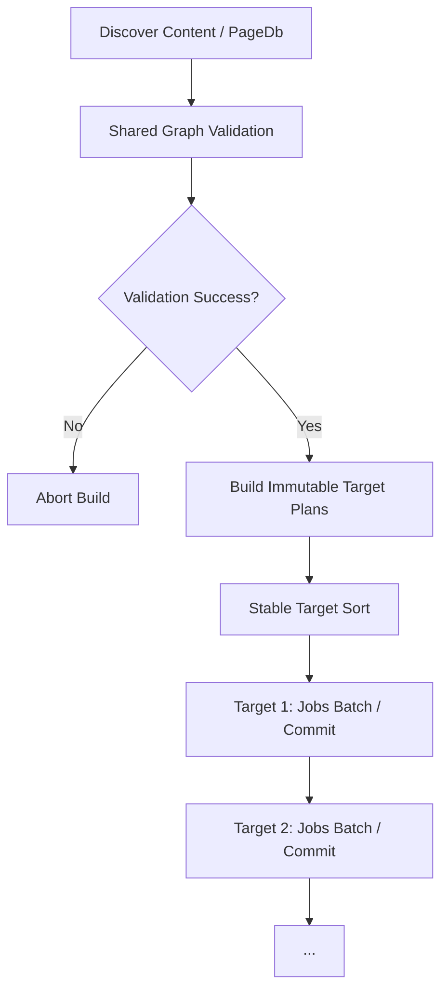

# Multi-Target Isolated Output & Cache Namespaces Contract (P3.3)

**Status:** normative contract  
**Version:** Boris/0.1.1 v0.1

This document specifies the CLI grammar, target validation, structural cache isolation, scheduling, and error boundaries for multi-target HTML site generation in Boris.

---

## 1. CLI target grammar & options

To support multiple explicitly named HTML build targets, we introduce a repeatable `--target` flag of the format:
```text
--target <NAME>=<OUTPUT_DIR>
```

### Constraints & Conflict Rules:
1. **Implies HTML mode:** Providing `--target` automatically sets the build mode to `.html`.
2. **Backward Compatibility:** If no `--target` is specified, but `--html` or `--html-dir` is provided, Boris defaults to a single target named `"default"` with output directory `--html-dir` (defaulting to `"dist"`).
3. **Mutual Exclusivity:**
   - `--target` cannot be combined with `--html-dir`, since targets explicitly define their own output directories.
   - `--target` is mutually exclusive with `--out`, `--rag`, and `--rag-dir`.
4. **Permitted Combinations:** `--html` is allowed alongside `--target` to explicitly declare HTML mode, but is redundant.
5. **Global options:** `--watch`, `--incremental`, and `--jobs` apply globally to all targets.

---

## 2. Target validation rules

Before starting any source discovery, page rendering, cache mutation, cleanup, or publication, Boris validates all targets. Any validation failure causes Boris to exit immediately with a usage error (exit code `2`).

### Target Name Rules:
- Non-empty alphanumeric string containing only letters, numbers, `-`, `_`, and `.`.
- Must not be `.` or `..`.

### Path Overlap & Safety Rules:
To guarantee absolute directory isolation, we resolve all target output directories to absolute paths relative to the current working directory (lexically resolving `.` and `..` segments, normalizing separators to `/`, stripping a trailing `/`, and preserving letter-case matching semantics of the target platform).
We enforce:
1. **Unique Target Names:** Duplicate target names are strictly rejected (`error.DuplicateTargetName`).
2. **No Output Root Overlap:**
   - Absolute path equality is rejected (`error.TargetOutputCollision`).
   - Parent/child nesting collisions are rejected (`error.TargetOutputCollision`). A path $A$ is a parent of $B$ if $B$ equals $A$ or is $A$ followed by a path separator (path-boundary prefix; sibling prefixes such as `dist` vs `dist-prod` are allowed).
   - Output paths must not escape the workspace. Workspace membership is also path-boundary prefix (rejects sibling false positives such as `/ws` vs `/ws-evil`).
   - Targeting the workspace root itself is rejected (`error.TargetOutputCollision`).
3. **No Content / Layout Overlap:** Target output roots must not equal or nest with the resolved `--input` content root, the resolved layout file path, or the layout file’s parent directory when that parent is not the workspace root (`error.TargetOutputCollision`). This prevents writing HTML into the source tree and prevents watch mode from ignoring content edits.
4. **No Symlinks as Target Roots:** When a target output path exists and is a symlink, it is rejected (`error.TargetOutputSymlink`). Intermediate path-component symlink walks are not required for this slice.
5. **Validation failures are usage errors:** Any of the above validation failures must abort before discovery/render and map to process exit code **2**.

---

## 3. Structural cache & configuration isolation

Cache isolation is strictly structural. Each target has its cache namespace and manifest isolated under its output directory:

```text
<target output root>/
  .boris-cache/
    manifest.json
```

### Configuration Identity Hashing:
Every page fingerprint hashes a stable **Target Configuration Identity**. The fingerprint includes:
- Cache-format/version discriminator (e.g., `boris-cache-v1-multitarget`)
- Target configuration digest, including:
  - Target name / stable namespace string
  - Global/target-specific layout path and layout template bytes/fingerprint
  - Target-specific options (if any) that affect emitted bytes
- Normalized page identity (`entity_id`)
- Source page file bytes
- Transitive include dependency bytes (sorted alphabetically)

This ensures that:
- Target A's stale cleanup only enumerates and removes files beneath Target A's root.
- Target A's staging/temp files cannot collide with Target B's.
- Target A's cache manifest cannot be read or overwritten by Target B.
- Accidental cache hits cannot leak across targets if their configuration, layouts, or settings differ.
- Old or pre-P3 cache directories (lacking a matching configuration/format discriminator) are safely invalidated, triggering a clean cold rebuild.
- On-disk `manifest.json` `format_version` must equal the fingerprint discriminator (currently `boris-cache-v1-multitarget`). Manifests with any other version string are ignored (cold rebuild for that target).

---

## 4. Shared vs. isolated state & scheduler model



### Explicit First-Slice Target Semantics:

| Area | Rule |
|---|---|
| Content roots | One shared `--input` content root |
| Graph/parser | Discover, parse, validate, and freeze once per invocation |
| Layout | One global layout path (`layouts/main.html` or custom) |
| Generated output as input | Forbidden; target output trees are never dependency roots |
| Cross-target dependencies | Forbidden |
| Target order | Sorted alphabetically by canonical target name before execution / commit |
| Legacy mode | `--html` / `--html-dir` maps to `default` target |
| Target mode | `--target NAME=DIR` implies HTML mode |
| Cache | Target-owned cache namespace and manifest |
| Watch | One change batch maps to all affected targets; target output events are ignored globally |

### Failure Policy:
1. **Validate All Targets First:** Before source discovery, rendering, cache mutation, cleanup, or publication, validate all target declarations and path isolation.
2. **Discover & Validate Shared Content Once:** Graph validation failure halts the process before any target is rendered.
3. **Construct Immutable Target Plans:** Identify dirty or cached files for each target.
4. **Execute Target Work sequentially in Sorted Target-Name Order:** Run page rendering batches through the P3.1 worker mechanism.
5. **Isolated Target Commits:** A target publishes only its own pages and updates its cache manifest if its own rendering succeeds.
6. **Graceful Fail-Fast & Rollback:** If Target A fails, it preserves its prior output/cache according to the atomic-file replacement contract. Unrelated Target B is allowed to finish and retain its successful publication.
7. **Nonzero Exit:** Return a nonzero aggregate result with deterministic target-ordered diagnostics if any target fails.

---

## 5. Watch mode & event fan-out

In `--watch` mode:
1. **Multi-Target Filter:** WatchCoordinator ignores file events originating from *any* of the target output directories to avoid infinite reload loops.
2. **Determinism:** When a shared source edit is detected, it fans out to rebuild all targets that depend on it. A target-specific layout/include edit affects only that target.
3. **Serialized Rebuilds:** Rebuilds run sequentially in a stable target-name order. No overlapping rebuilds or concurrent multi-target compilation are permitted.
