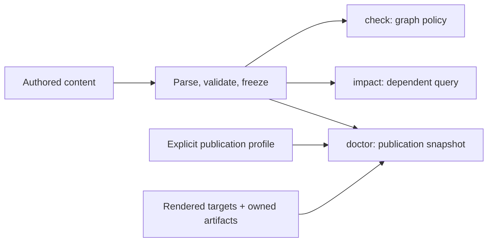

# Boris Doctor v1

**Status:** design proposal; no implementation

**Companion audit:** [`../audits/project-health-surface.md`](../audits/project-health-surface.md)

## Decision

Add one deterministic, offline, read-only publication-health command:

```text
boris doctor --profile FILE [--format human|json] [--report PATH]
             [--fail-on error|warning|never]
```

Doctor v1 is a **publication-snapshot auditor**. It validates source and graph
prerequisites, then compares the selected publication profile with existing
rendered targets and their owned artifacts. It does not build, render, publish,
repair, crawl, score, or certify anything.

Use the existing schema-v1 publication profile as the sole configuration source.
Do not invent a second Doctor manifest or infer a project root. Doctor should be
the first public **read-only** consumer of that profile only when the
publication-profile and CLI contracts are amended in the implementation PR.
This does not expose or imply `build --profile`.

One rule is load-bearing: a configured artifact that Doctor v1 does not support
must be shown as `not_in_scope` in report coverage. It must never be silently
counted as healthy.

## Product boundary

Doctor v1 covers exactly six health surfaces:

1. graph and source health;
2. internal rendered-link and fragment integrity;
3. local target-owned asset integrity;
4. structural accessibility findings;
5. metadata presence and consistency;
6. cross-artifact consistency for rendered search, XML sitemap, RSS 2.0, and
   llms.txt.

It consumes:

- the explicitly selected, strict publication profile;
- authored content through the current parser/pipeline;
- the validated frozen graph and existing analysis values;
- final HTML bytes in every declared target;
- source/theme asset inventories and target-owned asset bytes;
- configured search, sitemap, RSS, and llms.txt artifacts.

It performs no publication writes. The only permitted filesystem write is an
explicit report path.

## Non-goals

Doctor v1 explicitly rejects:

- numeric SEO, accessibility, editorial, readability, or aggregate health
  scores;
- network link checking, redirects, DNS, TLS, HTTP headers, robots.txt, or
  crawler simulation;
- LLM content, tone, usefulness, completeness, or alt-text judgments;
- inferred redirects or canonical targets;
- automatic alt text;
- automatic page/content merging or splitting;
- automatic source or layout rewriting;
- silent source, target, or artifact mutation;
- a `--fix` mode;
- a hosted service, browser automation framework, network crawler, generic
  plugin system, or arbitrary policy scripting;
- claims of WCAG, Lighthouse, search-engine, SEO, or accessibility compliance.

A missing `alt` attribute is an objective structural fact. Whether present text
is good is not.

## Relationship to existing commands

| Command | Question answered | Inputs | Default writes | Exit-policy owner |
|---|---|---|---|---|
| `boris check` | Is the frozen graph/dependency model valid, and does its existing unreferenced-page policy pass? | Authored content and frozen graph | None; optional report only | Existing Documentation Intelligence contract |
| `boris impact ID` | What transitively depends on this page/source endpoint? | Authored content and frozen graph | None; optional report only | Existing Documentation Intelligence contract |
| `boris doctor --profile FILE` | Does the existing publication match the validated source, profile, rendered structure, assets, and selected artifacts? | Profile, source/graph, rendered targets, owned artifacts | None; optional report only | New Doctor contract |

Doctor may call `pipeline.compile` and `intelligence.analyze` internally. It must
not call the `check` executable, reinterpret its JSON, or add fields/findings to
its report.

Compatibility invariants:

- `check` and `impact` command spellings, flags, JSON/human bytes, schemas, and
  exit behavior remain unchanged;
- they continue to reject publication/profile selectors under their existing
  contract;
- Doctor has its own format ID, schema version, finding catalog, sorting, and
  fail threshold;
- an existing `check` finding may appear as a Doctor finding, but that does not
  change either command’s severity or exit policy;
- invalid content/graph still returns existing deterministic compiler
  diagnostics before rendered auditing; Doctor does not publish a partial
  health report for an unfrozen graph.



## Configuration and selection

### Explicit profile only

`--profile FILE` is required in v1.

- No default filename or upward discovery exists.
- The profile’s normalized parent is the workspace root.
- All profile paths and `--report` resolve relative to that workspace.
- Absolute profile selection is allowed by the existing workspace resolver;
  fields inside the profile remain canonical workspace-relative paths.
- Doctor runs static profile validation before content discovery.
- Doctor audits every declared HTML target.
- Search is expected at its contracted fixed path for each HTML target.
- Sitemap, RSS, and llms.txt are checked only when selected by the public target
  plan. A selected-but-missing artifact is an error finding.
- IR/RAG/Context editions are `not_in_scope` coverage entries in v1.

The profile parser currently has no public CLI. Implementation must amend
`publication-profile.md` and `cli.md` before exposing Doctor. A design document
alone does not make `--profile` available.

### No target guessing

Doctor does not:

- assume `dist/` when a profile selected another target;
- discover a live deployment URL from HTML;
- infer which target is public;
- infer RSS/llms/sitemap locations;
- treat arbitrary files under a target as valid merely because they exist.

Expected ownership comes from the typed profile, frozen graph, theme inventory,
content-local asset inventory, and fixed compiler namespaces.
File extension and target location alone do not prove that an extra HTML file is
Boris-owned.

## Audit pipeline

```text
parse profile
→ static plan validation
→ compile/validate/freeze source graph read-only
→ derive expected per-artifact inventories
→ open target roots with no-follow path checks
→ inventory and parse final HTML
→ audit routes, fragments, assets, structure, and metadata
→ validate/re-derive search, sitemap, RSS, and llms.txt
→ normalize and sort findings
→ render report to stdout or explicit report path
```

Failures before graph freeze use existing diagnostics. Once the graph is valid,
missing or malformed configured publication artifacts are health findings,
not generic I/O failures. Permission failures, allocation failure, and
unexpected filesystem failures remain exit `3`.

## Expected artifact sets

Doctor must preserve current per-artifact eligibility. It must not invent one
universal “published page” set.

| Surface | Expected v1 set |
|---|---|
| HTML pages | Current canonical HTML output path for every validated graph page, matching current HTML behavior |
| Rendered search | Every current HTML page in the target, re-extracted from exact rendered bytes |
| Sitemap | Current non-draft HTML page paths under the configured site URL |
| RSS | Pages with both `published_at` and `summary`, excluding drafts, ordered and limited exactly by the RSS contract |
| llms.txt | Current graph order and current summary/`/<entity-id>/` link contract |
| Content-local assets | Exact source sibling asset inventory mapped to canonical target paths |
| Theme assets | Exact selected theme inventory mapped to target-owned `assets/` paths |

If these product policies change, their owning contracts change first. Doctor
adapts to them; Doctor does not become their source of truth.

## Finding model

Every finding has exactly these fields:

| Field | Type | Rule |
|---|---|---|
| `code` | string | Stable closed v1 code |
| `domain` | enum | `graph`, `source`, `rendered_html`, `asset`, `accessibility`, `metadata`, or `artifact` |
| `severity` | enum | `error`, `warning`, or `info` |
| `confidence` | enum | `certain`, `high`, or `limited`; assigned by the check definition, never a probability |
| `owner` | enum | `content`, `theme`, `publication`, `configuration`, or `unknown` |
| `subject` | object | Stable `kind`, `id`, and nullable target name |
| `source_location` | location or null | Profile-workspace-relative authored path and 1-based byte line/column |
| `output_location` | location or null | Profile-workspace-relative rendered/artifact path and 1-based byte line/column |
| `configuration_location` | location or null | Selected profile path and location when attributable |
| `evidence` | object | Fixed `observed`, `expected`, and sorted `related` strings |
| `remediation` | string | Code-owned concise manual action |
| `fixability` | enum | `source_edit`, `layout_edit`, `configuration_edit`, `regenerate`, or `not_actionable` |

`fixability` describes the smallest likely class of work. It does not authorize
Doctor to make that change.

### Severity

- `error`: the existing publication contradicts a validated/configured fact,
  cannot be inspected completely, or contains a broken local route/fragment.
- `warning`: an objective structural or metadata risk that current publication
  contracts permit.
- `info`: a useful non-failing fact with an explicit policy basis. Clean counts
  belong in summary, not as info findings.

### Confidence

- `certain`: direct byte/path/set equality or a strict parser result;
- `high`: structurally recovered evidence with exact bytes but incomplete
  source ownership attribution;
- `limited`: objective evidence whose owner/location cannot be localized.

V1 does not emit speculative findings. A malformed document produces
`HTML_MALFORMED` and prevents claims that skipped downstream checks passed.

### Owner attribution

When the selected layout exposes one
`<main data-boris-search-root>`, findings inside that range are `content` and
outside it are `theme`. Without a unique marker, ownership is `unknown`.
Artifact set/byte mismatches are `publication`; invalid declared metadata/paths
are `configuration`.

When grouped evidence for `HTML_DUPLICATE_ID` spans multiple ownership regions,
the finding uses `owner: unknown` and `fixability: not_actionable`, while
retaining every occurrence in `evidence.related`.

Doctor must not label a finding `compiler` merely because Boris produced the
current expected bytes. It cannot prove which tool or revision created the
observed tree.

### Initial stable code catalog

| Code | Domain | Default severity | Confidence | Typical owner | Fixability |
|---|---|---:|---|---|---|
| `GRAPH_UNREFERENCED_PAGE` | graph | warning | certain | content | source_edit |
| `TARGET_MISSING` | rendered_html | error | certain | publication | regenerate |
| `HTML_PAGE_MISSING` | rendered_html | error | certain | publication | regenerate |
| `HTML_MALFORMED` | rendered_html | error | certain | unknown | source_edit or layout_edit |
| `HTML_URL_MALFORMED` | rendered_html | error | certain | content/theme by range | source_edit or layout_edit |
| `HTML_LOCAL_ROUTE_MISSING` | rendered_html | error | certain | content/theme by range | source_edit or layout_edit |
| `HTML_LOCAL_ROUTE_ESCAPE` | rendered_html | error | certain | content/theme by range | source_edit or layout_edit |
| `HTML_FRAGMENT_MISSING` | rendered_html | error | certain | content/theme by range | source_edit or layout_edit |
| `HTML_DUPLICATE_ID` | rendered_html | warning | certain | content/theme by range | source_edit or layout_edit |
| `ASSET_MISSING` | asset | error | certain | publication | regenerate |
| `ASSET_STALE` | asset | warning | certain | publication | regenerate |
| `ASSET_BYTES_MISMATCH` | asset | error | certain | publication | regenerate |
| `ASSET_PATH_ESCAPE` | asset | error | certain | publication | regenerate |
| `ASSET_SYMLINK` | asset | error | certain | publication | regenerate |
| `A11Y_IMG_ALT_MISSING` | accessibility | warning | certain | content/theme by range | source_edit or layout_edit |
| `A11Y_HEADING_LEVEL_JUMP` | accessibility | warning | certain | content/theme by range | source_edit or layout_edit |
| `A11Y_DOCUMENT_LANG_MISSING` | accessibility | warning | certain | theme | layout_edit |
| `A11Y_MAIN_MISSING` | accessibility | warning | certain | theme | layout_edit |
| `A11Y_MULTIPLE_MAIN` | accessibility | warning | certain | theme | layout_edit |
| `META_TITLE_MISSING` | metadata | warning | certain | theme | layout_edit |
| `META_MULTIPLE_TITLES` | metadata | warning | certain | theme | layout_edit |
| `META_CHARSET_MISSING` | metadata | warning | certain | theme | layout_edit |
| `META_CANONICAL_MISSING` | metadata | warning | certain | theme | layout_edit |
| `META_CANONICAL_MISMATCH` | metadata | error | certain | theme/configuration | layout_edit |
| `META_MULTIPLE_CANONICALS` | metadata | error | certain | theme | layout_edit |
| `META_CANONICAL_COLLISION` | metadata | error | certain | publication | layout_edit |
| `SEARCH_MISSING` | artifact | error | certain | publication | regenerate |
| `SEARCH_MALFORMED` | artifact | error | certain | publication | regenerate |
| `SEARCH_DOCUMENT_MISSING` | artifact | error | certain | publication | regenerate |
| `SEARCH_DOCUMENT_STALE` | artifact | error | certain | publication | regenerate |
| `SEARCH_CONTENT_MISMATCH` | artifact | error | certain | publication | regenerate |
| `SITEMAP_MISSING` | artifact | error | certain | publication | regenerate |
| `SITEMAP_MALFORMED` | artifact | error | certain | publication | regenerate |
| `SITEMAP_URL_MISSING` | artifact | error | certain | publication | regenerate |
| `SITEMAP_URL_STALE` | artifact | error | certain | publication | regenerate |
| `SITEMAP_URL_DUPLICATE` | artifact | error | certain | publication | regenerate |
| `RSS_MISSING` | artifact | error | certain | publication | regenerate |
| `RSS_MALFORMED` | artifact | error | certain | publication | regenerate |
| `RSS_ITEM_MISSING` | artifact | error | certain | publication | regenerate |
| `RSS_ITEM_STALE` | artifact | error | certain | publication | regenerate |
| `RSS_CONTENT_MISMATCH` | artifact | error | certain | publication | regenerate |
| `LLMS_MISSING` | artifact | error | certain | publication | regenerate |
| `LLMS_MALFORMED` | artifact | error | certain | publication | regenerate |
| `LLMS_LINK_MISSING` | artifact | error | certain | publication | regenerate |
| `LLMS_LINK_STALE` | artifact | error | certain | publication | regenerate |
| `LLMS_CONTENT_MISMATCH` | artifact | error | certain | publication | regenerate |

`HTML_DUPLICATE_ID` is a warning because Apex duplicate heading IDs are a
documented current behavior. A fragment that names the duplicated value exists,
but is ambiguous; Doctor does not invent suffixes.

Doctor v1 deliberately has no `HTML_PAGE_STALE` finding. It reports missing
expected pages, but it does not classify extra HTML as stale until publication
execution records an owned-output manifest.

Where the table lists two possible fixability values, the emitted finding uses
exactly one enum after content/theme ownership attribution. If attribution is
unknown, fixability is `not_actionable` and the owner remains `unknown`; Doctor
still performs no edit.

`META_CANONICAL_MISSING` runs only for a public target with configured
`site.url`. No configured URL means `not_configured` coverage for canonical
consistency, not a finding.

## Deterministic JSON report

The report format is separate from IR and Documentation Intelligence:

```json
{
  "format": "boris-doctor-report",
  "schema_version": 1,
  "compiler": "boris/0.8.1",
  "profile": {
    "path": "boris.publication.json",
    "schema_version": 1
  },
  "summary": {
    "targets": 1,
    "pages": 22,
    "assets": 4,
    "artifacts": 4,
    "errors": 0,
    "warnings": 2,
    "info": 0
  },
  "coverage": [
    {"check": "graph", "domain": "graph", "status": "checked", "subjects": 22},
    {"check": "source", "domain": "source", "status": "checked", "subjects": 22},
    {"check": "rendered_html", "domain": "rendered_html", "status": "checked", "subjects": 22},
    {"check": "asset", "domain": "asset", "status": "checked", "subjects": 4},
    {"check": "accessibility", "domain": "accessibility", "status": "checked", "subjects": 22},
    {"check": "metadata.document", "domain": "metadata", "status": "checked", "subjects": 22},
    {"check": "metadata.canonical", "domain": "metadata", "status": "checked", "subjects": 22},
    {"check": "artifact.search", "domain": "artifact", "status": "checked", "subjects": 1},
    {"check": "artifact.sitemap", "domain": "artifact", "status": "checked", "subjects": 1},
    {"check": "artifact.rss", "domain": "artifact", "status": "checked", "subjects": 1},
    {"check": "artifact.llms", "domain": "artifact", "status": "checked", "subjects": 1},
    {"check": "editions.ir_rag_context", "domain": "artifact", "status": "not_in_scope", "subjects": 0}
  ],
  "findings": [
    {
      "code": "HTML_DUPLICATE_ID",
      "domain": "rendered_html",
      "severity": "warning",
      "confidence": "certain",
      "owner": "content",
      "subject": {
        "kind": "page",
        "id": "comparison",
        "target": "public"
      },
      "source_location": null,
      "output_location": {
        "path": "dist/comparison.html",
        "line": 169,
        "column": 1
      },
      "configuration_location": null,
      "evidence": {
        "observed": "id=\"why-choose-boris\" occurs 3 times",
        "expected": "each non-empty id occurs at most once per document",
        "related": [
          "dist/comparison.html:169:1",
          "dist/comparison.html:178:1",
          "dist/comparison.html:186:1"
        ]
      },
      "remediation": "Give each rendered element a unique id; do not rely on an ambiguous fragment.",
      "fixability": "source_edit"
    }
  ]
}
```

The implementation contract should add
`docs/contracts/schemas/doctor-1.schema.json` with:

- `additionalProperties: false` at every object level;
- every displayed field required;
- nullable location objects with required `path`, `line`, and `column`;
- closed enums shown above;
- a closed coverage-check catalog and
  `checked | not_configured | not_in_scope | incomplete` status enum;
- non-negative integer summary/coverage counts;
- no timestamps, durations, hostnames, invocation CWD, absolute paths, random
  IDs, mtimes, or locale-dependent text;
- only profile-workspace-relative `/`-separated paths;
- JSON strings emitted through the shared `json_out` encoder.

The JSON Schema constrains report structure and values. The Doctor renderer
contract, golden fixtures, and deterministic byte tests enforce canonical key
order exactly as shown in the example.

### Sorting

Coverage uses the fixed check order shown above:

| Selection and inspection result | Coverage status |
|---|---|
| Selected and successfully inspected | `checked` |
| Not selected by the profile | `not_configured` |
| Outside Doctor v1 | `not_in_scope` |
| Selected but missing, parseably malformed, or structurally uninspectable | `incomplete` |

A selected missing or parseably malformed artifact produces its stable finding
and `incomplete` coverage; it never reports `checked`. Permission denial and
unexpected I/O failures are exit `3`, so no new report is published.

Findings sort by:

1. severity rank: error, warning, info;
2. domain enum order;
3. target name, null last;
4. subject kind, then subject ID;
5. output path, line, column;
6. source path, line, column;
7. code;
8. evidence `observed`.

`evidence.related` is bytewise sorted and deduplicated. Counts are computed
after deduplication. Filesystem enumeration, hash-map iteration, profile JSON
key order, worker count, mtime, and wall clock cannot affect bytes.

### Report publication

Without `--report`, the selected format goes to stdout.

With `--report PATH`:

- the path is profile-workspace-relative;
- it must not equal, contain, or be contained by source, target, asset, or
  selected artifact paths;
- only this file may be written;
- replacement is atomic on the normal same-volume path;
- validation, audit, formatting, or write failure preserves a prior report.

## Concise human report

Human output uses the same finding order and facts:

```text
Boris Doctor v1
profile: boris.publication.json
coverage: 1 target, 22 pages, 4 assets, 4 artifacts
result: healthy with warnings (0 errors, 2 warnings)

WARN HTML_DUPLICATE_ID [public:comparison]
  output: dist/comparison.html:169:1
  observed: id="why-choose-boris" occurs 3 times
  fix: Give each rendered element a unique id; do not rely on an ambiguous fragment.

WARN A11Y_HEADING_LEVEL_JUMP [public:guides/apex-markdown]
  output: dist/guides/apex-markdown.html:131:1
  observed: h1 is followed by h3
  fix: Insert the missing heading level or lower the later heading.
```

No score, grade, badge, percentage, or compliance claim appears.

## CLI behavior

### Options

| Option | Default | Meaning |
|---|---|---|
| `--profile FILE` | required | Explicit schema-v1 publication profile; no discovery |
| `--format human\|json` | `human` | Report serialization |
| `--report PATH` | stdout | Sole permitted write; profile-workspace-relative |
| `--fail-on error\|warning\|never` | `error` | Lowest finding severity that returns exit 1 |
| `--help`, `-h` | — | Print help and exit 0 without reading profile/content/targets |

Unknown, duplicate, empty, or conflicting flags are usage errors. There is no
`--fix`, `--network`, `--score`, `--rules`, `--plugin`, implicit profile, or
target subset option in v1.

`--fail-on warning` fails for errors or warnings. `--fail-on never` returns 0
after a completed audit regardless of findings; it does not turn invalid
profile/content or I/O failure into success.

### Exit codes

| Code | Meaning |
|---:|---|
| `0` | Completed audit with no finding at/above the threshold, or completed audit with `--fail-on never` |
| `1` | Invalid content/graph, or completed audit with a finding at/above the threshold |
| `2` | Usage/profile configuration error, including invalid schema or unsafe/overlapping path |
| `3` | I/O/system/report-publication failure |

Missing target roots or selected artifacts are completed-audit error findings,
not exit `3`. An existing path that cannot be read because of permissions or an
unexpected filesystem failure is exit `3` and publishes no partial report.

## Detailed checks

### Graph and source health

- Run the current parser, graph, relation, include, and reference validators.
- Require a valid frozen graph before target auditing.
- Reuse `intelligence.analyze` for existing unreferenced-page facts.
- Do not add “unreachable” without an explicit entry-point policy.
- Do not import migration-lab’s frontmatter grammar.
- Derive content-local assets with current source ownership and SVG rules.

Invalid graph behavior stays aligned with `check`: existing diagnostics, exit
1, no Doctor report replacing a prior successful report.

### Rendered links and fragments

- Parse real tags and attributes; do not substring-search.
- Audit single URL-bearing `href` and `src` values. `srcset` remains out until a
  separate grammar is designed.
- Skip empty, scheme-bearing, and protocol-relative URLs without network I/O.
- Resolve path/query/fragment locally using the current manifest resolver.
- Decode traversal to stability under the current bounded rule before any path
  access.
- Build each page’s ID set from decoded rendered attribute values.
- Check hash-only, query-plus-hash, relative, root-relative, and cross-page
  fragments.
- URL-decode a fragment once for browser identity matching; malformed URL
  escapes are `HTML_URL_MALFORMED`.
- A duplicated target ID satisfies membership but separately reports
  `HTML_DUPLICATE_ID`.

Doctor is not an HTML5 conformance validator. `HTML_MALFORMED` is limited to
byte structures the checked scanner can prove are unrecoverable for this audit,
such as an unterminated tag, comment, quoted attribute, or raw-text element.
Unrecognized but bounded markup is not judged.

Do not change the compiler’s current `EROUTEMISSING`, `EROUTEESCAPE`, or
reserved `EFRAGMENTMISSING` behavior in Doctor Slice 1.

### Local assets

- Expected inventory comes from content-local and selected theme assets.
- Exact source/theme bytes are compared with target bytes using SHA-256 and,
  on digest mismatch, exact bytes.
- Symlinks are rejected with no-follow checks.
- References are validated against the expected page/asset/artifact manifest,
  not arbitrary filesystem existence.
- Stale checks are confined to compiler-owned `assets/`, `*.assets/`, search,
  sitemap, RSS, and llms paths. Doctor never labels unrelated target files
  stale.
- No SVG rewriting, image decoding, optimization, or remote fetch occurs.

### Structural accessibility

Doctor reports only:

- `img` without an `alt` attribute; `alt=""` passes;
- a heading level increase greater than one in rendered document order;
- missing/empty `html[lang]`;
- zero or more than one rendered `main`.

It does not evaluate alt text, landmark usefulness, contrast, keyboard
behavior, ARIA correctness, focus order, media captions, or WCAG conformance.
Those require editorial judgment, browser behavior, or a broader standard.

### Metadata

- exactly one non-empty `<title>`;
- one early charset declaration;
- when public `site.url` exists, exactly one canonical link per HTML page;
- canonical URL equals normalized site URL plus the canonical output path;
- canonical URLs are unique across pages.

Doctor does not require keywords, Open Graph, Twitter cards, schema.org,
descriptions, `lastmod`, or arbitrary SEO tags. It does not infer canonical
URLs when `site.url` is absent.

### Artifact consistency

Search:

- parse exact v1 format/schema/types;
- re-run `search_index.indexHtml` over sorted final HTML paths;
- compare document set and full deterministic fields;
- verify every stored non-empty fragment exists on its document.

Sitemap:

- parse only the contracted XML shape;
- reject duplicates and malformed URLs;
- compare sorted URLs with in-memory `sitemap.render` output and non-draft
  expected routes.

RSS:

- parse the contracted channel/item vocabulary;
- compare channel metadata, item eligibility/order/limit, URLs, dates,
  summaries, and tags with `rss.render`;
- require item links to address current HTML routes.

llms.txt:

- expose the current renderer as a borrowed-result function without changing
  legacy bytes;
- compare exact bytes and parsed page-link set;
- judge links using the current llms.txt `/<id>/` contract, not the HTML
  `.html` sitemap route convention.

An exact-byte mismatch may coexist with a more specific stale/missing reference
finding. Deduplication is by full stable finding identity, not by message text.

## Implementation slices

Each slice is independently reviewable, adds focused hostile fixtures, and
keeps legacy gates green.

### Slice 1 — internal rendered HTML + search snapshot

Do not expose a CLI yet.

- Add an internal Doctor report/finding type and one-target rendered analyzer.
- Extract or expose the current manifest/path resolver from `src/link_audit.zig`
  without changing compiler diagnostics or exits.
- Add a checked HTML scan API beside existing `html_scan` callers.
- Inventory sorted HTML, reject path escape/symlink, index IDs, and report
  malformed HTML, missing/escaping local routes, missing fragments, and
  duplicate IDs.
- Strictly parse search v1 and compare its document set/full re-indexed content.
- Add schema/example goldens for only the emitted Slice 1 codes.

This is the recommended first card because it complements the existing graph
check and product route gate. It does not refactor Documentation Intelligence,
publication coordination, RSS, llms, or accessibility policy.

### Slice 2 — graph/source and asset inventory

- Reuse `pipeline.compile` and `intelligence.analyze`.
- Derive expected HTML routes per current status behavior.
- Reuse content-local and theme asset inventory/validation read-only.
- Compare expected/stale/missing/mismatched owned asset paths and bytes.
- Prove no target/source writes.

### Slice 3 — structural accessibility and metadata

- Add only the closed structural checks defined above.
- Add unique search-root ownership attribution where available.
- Add title/charset/lang/main/canonical checks.
- Keep every new advisory warning non-failing under the default threshold.

### Slice 4 — sitemap, RSS, and llms consistency

- Add strict artifact readers.
- Refactor existing renderers only enough for borrowed in-memory output.
- Compare standalone legacy bytes before/after refactors.
- Add per-artifact status/eligibility matrix fixtures.

### Slice 5 — profile consumer, CLI, and release gate

- Amend publication-profile and CLI contracts for read-only Doctor selection.
- Reject or visibly mark every configured out-of-scope edition.
- Add deterministic JSON and concise human renderers.
- Add atomic explicit-report publication and exit threshold.
- Add black-box compatibility, no-network, no-write, dogfood, and release-gate
  coverage.
- Expose help only after every Doctor v1 code and configured artifact path is
  honored or rejected before audit.

No slice modifies README or public content until executable behavior ships and
its claims are verified.

## Hostile test matrix

| Required case | Fixture/action | Expected evidence |
|---|---|---|
| Path escape | `../`, absolute, backslash, `%2e%2e`, `%252e%252e`, encoded slash; symlink parent | `HTML_LOCAL_ROUTE_ESCAPE`, `ASSET_PATH_ESCAPE`, or profile exit 2; no outside-root access |
| Malformed HTML | unterminated tag/comment/quote/raw-text | `HTML_MALFORMED`; downstream coverage for that page is not claimed |
| Malformed local URL | malformed percent escape or encoded separator ambiguity | `HTML_URL_MALFORMED`; no path access occurs |
| Duplicate IDs | same ID on headings and non-headings; entity-decoded equivalents; occurrences inside and outside the unique search root | one sorted `HTML_DUPLICATE_ID` finding per value/page; cross-region evidence has unknown owner and is not actionable |
| Extra HTML ownership | `404.html`, verification page, retained landing page, and host-generated page outside an ownership manifest | no `HTML_PAGE_STALE` finding; the files remain eligible for checks that do not require Boris ownership |
| Broken relative links | nested `href` and `src`, single/double/unquoted attributes | `HTML_LOCAL_ROUTE_MISSING` at exact output line/column |
| Missing fragments | hash-only, cross-page, query+hash, encoded Unicode, missing target ID | `HTML_FRAGMENT_MISSING`; duplicate target ID also reports its warning |
| Missing local assets | content-local, theme, raw HTML image, stylesheet | `ASSET_MISSING` or rendered route finding; no remote fetch |
| Stale search links | extra/missing document and changed section/fragment | stable `SEARCH_DOCUMENT_STALE`/`MISSING` and `SEARCH_CONTENT_MISMATCH` |
| Stale sitemap links | extra/missing/duplicate URL, wrong base, draft inclusion | stable sitemap findings in canonical order |
| Stale RSS links | ineligible draft, removed route, wrong channel/item metadata/order | stable RSS findings and content mismatch |
| Stale llms links | removed/extra page, wrong summary/order/link form | stable llms findings and content mismatch |
| Duplicate canonical URLs | two pages with same normalized canonical | `META_CANONICAL_COLLISION` on both subjects in sorted order |
| Missing alt | missing, empty, whitespace, case variants | only truly absent attribute warns; empty/present passes |
| Heading-level jumps | `h1→h3`, `h2→h4`, downward changes, repeated levels | only increases greater than one warn |
| Deterministic ordering | shuffled creation/profile key order; repeated runs | byte-identical JSON/human reports and fixed finding order |
| Unchanged prior outputs | hash source, HTML, assets, search, sitemap, RSS, llms, check/impact goldens before/after | every byte unchanged; prior report preserved on Doctor failure |
| No network access | remote `http`, `https`, protocol-relative, `ftp`, `blob`, and `urn` references; Doctor modules accept filesystem capabilities only | identical report with unreachable hostnames; no socket/client dependency or request |
| No source writes | read-only fixture permissions plus pre/post tree digest/listing | only explicit report path changes |

Additional compatibility tests:

- current Documentation Intelligence JSON/human goldens remain byte-identical;
- `check` unreferenced exit remains 1 and `impact` success remains 0;
- invalid graph still preserves a prior `check`, Doctor, and publication report;
- legacy standalone search/sitemap/RSS/llms bytes remain unchanged after
  renderer reuse;
- clean/incremental/parallel publication trees produce the same Doctor report;
- the checked-in public content tree is audited as dogfood without being
  modified.

## Acceptance criteria

Doctor v1 is complete only when:

- the command is deterministic, offline, and read-only except for explicit
  report output;
- every configured in-scope target/artifact is checked or fails visibly;
- every finding uses the stable model and code catalog;
- invalid content never yields a partial health report;
- structural warnings do not imply certification or fail by default;
- no source, target, or prior artifact byte changes;
- `check` and `impact` schemas, reports, and exits are unchanged;
- all hostile tests and `zig build test` pass;
- the release gate contains a black-box profile/Doctor determinism and
  no-mutation section;
- public docs are updated only after the executable surface exists.
