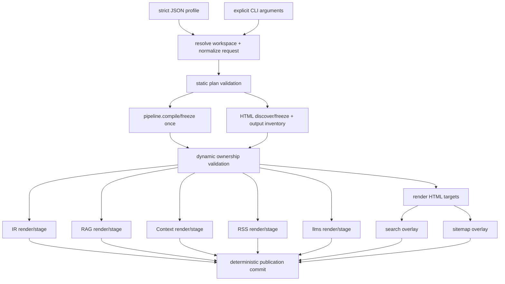

# Canonical publication profile

Status: historical proposal; non-normative design rationale

The canonical ownership model is now
[`../contracts/publication-model.md`](../contracts/publication-model.md), and
the implemented parser/static-plan surface is
[`../contracts/publication-profile.md`](../contracts/publication-profile.md).
The examples and invocation spellings below remain proposal text; they are not
a current CLI or publication-plan contract.

Date: 2026-07-29

Evidence base:
[`../audits/publication-surface.md`](../audits/publication-surface.md)

## Decision

Add an explicitly selected, strict JSON publication profile that normalizes to
one immutable `PublicationPlan`. A separate `PublicationExecution` records
run-only controls, and a `PublicationRequest` combines both for execution.

The first shipped syntax should be:

```text
boris build --profile boris.publication.json
```

There is no automatic profile discovery in v1. Without `--profile`, the CLI,
defaults, conflicts, paths, artifact bytes, and exit behavior remain unchanged.

The profile coordinates:

- one or more HTML targets;
- the automatic rendered-search artifact for every HTML target;
- optional RSS, sitemap, and llms.txt files owned by one public HTML target;
- optional project-level JSON IR, RAG, and Context editions.

It records site URL, title, and description once. It does not add a general
configuration language, change frontmatter, fetch remote resources, load
plugins, or make analysis commands publish.

The implementation should initially share one `pipeline.Result` among the
machine exporters while continuing to use the existing HTML
`PageDb`/`FrozenSite` path. HTML/IR graph unification is deliberately deferred
until explicit equivalence tests make it safe.

## Goals

1. Represent one complete, deterministic publication as an explicit set of
   human and machine outputs.
2. Remove repeated deployment metadata from normal project invocations.
3. Validate every selected output and cross-output path before publishing.
4. Build all coordinated pipeline-based editions from one immutable compile
   result and one source revision.
5. Preserve the existing HTML multi-target sharing and isolated target model.
6. Keep every existing CLI flag usable; allow CLI values to override profile
   values without hidden precedence.
7. Preserve current artifact schemas until their contracts are deliberately
   amended.
8. Keep the profile grammar small, closed, bounded, offline, and implementable
   in Zig `std`.

## Non-goals

- YAML, TOML, arbitrary expressions, environment interpolation, includes, or a
  general task runner;
- remote deployment, upload, URL probing, feed submission, or sitemap pinging;
- an extension/plugin registry;
- changing author frontmatter or Trunk/Satellite graph semantics;
- replacing Apex, the Zig build, themes, or layouts;
- making `check` or `impact` produce publication artifacts;
- absorbing migration labs or source-RAG into the product compiler;
- promising a single graph representation before equivalence is proven;
- Atom, JSON Feed, `robots.txt`, sitemap indexes, `llms-full.txt`, or new export
  formats;
- broad watch-mode orchestration in the first slice.

## Constraints preserved

| Constraint | Design consequence |
|---|---|
| No Node or JavaScript application layer | Parsing, validation, normalization, coordination, and emission remain Zig code |
| No general YAML configuration | One strict, versioned JSON schema; no aliases or implicit coercion |
| No removal of existing flags | Legacy invocations keep their current parser and semantics |
| CLI can override project configuration | Explicit arguments are applied after profile normalization; ambiguous overrides fail |
| No implicit project discovery | The selected profile file's normalized parent is the profile workspace; no Git/package-root search occurs |
| No hidden network access | URLs are validated as strings only; profile loading is local filesystem I/O |
| Deterministic output | Objects normalize to typed fields; named collections and layout rules use the existing canonical ordering |
| Existing contracts authoritative | Coordination preserves current artifact bytes unless a named contract change says otherwise |
| Analysis remains read-only | `check` and `impact` reject `--profile` in v1 and never execute publication entries |
| Labs remain separate | Profile schema has no lab, migration, or source-RAG fields |
| `content/` is a product artifact | Integration and hostile tests use both focused fixtures and the checked-in public content tree |

## Design alternatives

### Option A: no file, composable CLI only

Example:

```text
boris build --html-dir dist --sitemap --rss --llms \
  --site-url https://docs.example.test/ \
  --rss-title "Example Docs" \
  --rss-description "Product documentation" \
  --out .boris --rag-dir rag --context-dir context
```

Advantages:

- no parser or new on-disk format;
- flags remain the only configuration model;
- easy for one-off use and generated CI commands.

Costs:

- long invocations repeat metadata and output intent;
- quoting and repeated target/layout rules are fragile across shells;
- no reviewed project artifact states what a complete publication contains;
- cross-output validation still requires a canonical plan internally;
- adding “disable,” “only,” or per-output scope flags expands an already dense
  CLI grammar;
- the same project intent must be duplicated across local scripts and CI.

Assessment: useful as an implementation capability and override layer, but not
a sufficient canonical project representation.

### Option B: small Boris-specific grammar

Example:

```text
publication 1
input content
site https://docs.example.test/ "Example Docs" "Product documentation"
target public dist theme themes/boris
target public sitemap sitemap.xml
target public rss rss.xml limit 20
edition ir .boris
edition rag rag
```

Advantages:

- closed vocabulary and concise syntax;
- comments and domain-specific errors could be pleasant;
- no third-party runtime.

Costs:

- Boris would need to own tokenization, quoting, escaping, duplicate handling,
  source locations, fuzzing, and version migration for another language;
- nested layout rules and output options quickly turn the “small” grammar into
  a general config parser;
- schema tooling and fixture validation would be bespoke;
- it adds a second closed author grammar beside frontmatter without product
  evidence that a custom language improves publication behavior.

Assessment: technically consistent with a Zig-only product, but more parser
surface than this problem requires.

### Option C: strict JSON project manifest

Advantages:

- Zig `std` already supports JSON parsing; no product runtime is added;
- the repository already treats strict JSON schemas, duplicate/unknown fields,
  bounded parsing, and deterministic JSON as normal compiler work;
- nested targets, layout rules, and independently optional editions are
  unambiguous;
- a `format` discriminator and `schema_version` give explicit evolution;
- editors and CI can validate a checked-in artifact without executing Boris;
- JSON has no native comments, anchors, tags, or environment expansion to
  accidentally become a general configuration language.

Costs:

- hand-authored JSON is noisier than a purpose-built grammar;
- duplicate-key rejection must be explicit rather than delegated to a
  permissive decoded object;
- paths and cross-field requirements still need Boris-specific validation;
- users cannot annotate the file with comments.

Assessment: recommended. It creates the least new semantic machinery while
remaining durable and reviewable.

### Option D: checked-in `build.zig` publication wrapper

The repository already uses Zig's build system, so a project could encode
repeated Boris arguments in a custom build step.

Advantages:

- no new data grammar;
- can express arbitrary local build orchestration;
- repository-consistent for Boris contributors.

Costs:

- publication intent becomes executable build code rather than bounded data;
- projects using a distributed Boris binary would need a Zig build project;
- validation, diagnostics, and tooling cannot inspect intent without running
  the build;
- arbitrary code defeats the “closed, offline, deterministic project input”
  boundary;
- it couples ordinary documentation authors to compiler build mechanics.

Assessment: acceptable as an external wrapper, not a canonical Boris product
layer.

## Proposed schema

File name is conventional only; v1 requires an explicit path:

```json
{
  "format": "boris-publication-profile",
  "schema_version": 1,
  "input": "content",
  "input_format": "markdown",
  "site": {
    "url": "https://docs.example.test/",
    "title": "Example documentation",
    "description": "Reference and guides for Example."
  },
  "targets": [
    {
      "name": "public",
      "output": "dist",
      "public": true,
      "theme": "themes/boris",
      "layout_rules": [
        {
          "selector": "glob:guides/**",
          "layout": "themes/boris/layouts/guide.html"
        }
      ],
      "sitemap": {
        "path": "sitemap.xml"
      },
      "rss": {
        "path": "rss.xml",
        "limit": 20
      },
      "llms": {
        "path": "llms.txt"
      }
    },
    {
      "name": "preview",
      "output": "dist-preview",
      "layout": "themes/boris/layouts/main.html"
    }
  ],
  "editions": {
    "ir": {
      "output": ".boris"
    },
    "rag": {
      "output": "rag",
      "split_size": 200000
    },
    "context": {
      "output": "context",
      "scope": "guides/"
    }
  }
}
```

This example is proposed syntax, not accepted by the current executable.

### Profile workspace root

The explicit profile path establishes the only project boundary in profile
mode:

1. Resolve `--profile PATH` against the invocation's current working directory
   and normalize it to an absolute file path.
2. The normalized parent directory of that file is the **profile workspace
   root**.
3. Resolve every path read from the profile relative to that workspace root.
4. Resolve path-valued CLI overrides supplied with `--profile` relative to the
   same workspace root.

Boris does not search for a Git root, package root, `build.zig`, or conventional
profile filename. It does not walk parent directories. The selected file alone
defines the workspace.

Profile path fields and profile-mode path overrides use a workspace-relative
grammar. Absolute/drive-rooted values and lexical `..` escapes are rejected.
Normalized paths must remain inside the workspace with path-boundary
containment, rather than string-prefix containment. Existing Boris policies
remain applicable:

- lexical containment and static root-overlap checks run before discovery;
- existing path components are checked without following symlinks during
  dynamic ownership validation and again immediately before publication;
- a non-existent output leaf is allowed when its normalized path is contained,
  none of its existing parent components is a symlink/non-directory, and later
  ownership checks pass;
- input and layout existence/readability errors remain ordinary pre-publication
  I/O or usage failures under their focused contracts.

Legacy invocations without `--profile` retain their current CWD-relative path
semantics.

For `/srv/example/boris.publication.json`, these invocations resolve `input`,
targets, layouts, and edition roots identically:

```text
cd /srv/example
boris build --profile boris.publication.json

cd /tmp
boris build --profile /srv/example/boris.publication.json
```

In both cases, profile `"input": "content"` resolves to
`/srv/example/content`, and target `"output": "dist"` resolves to
`/srv/example/dist`. A profile-mode override is rooted the same way:

```text
cd /tmp
boris build --profile /srv/example/boris.publication.json --html-dir preview
```

Here `preview` resolves to `/srv/example/preview`, not `/tmp/preview`.

### Top-level fields

| Field | Required | Semantics |
|---|---|---|
| `format` | Yes | Must equal `boris-publication-profile` exactly |
| `schema_version` | Yes | Integer `1`; independent from IR schema versions |
| `input` | No | Workspace-relative content root; current default `content` |
| `input_format` | No | Closed whole-tree authoring format: `markdown` (default) or `textile` |
| `site` | Conditional | Publication metadata required by RSS/sitemap; otherwise optional and inert |
| `targets` | No | HTML targets; omission means the profile has no HTML publication |
| `editions` | No | Optional project-level machine editions |

At least one target-owned output or machine edition must be enabled. Unknown
fields are errors at every object level.

### Authored input format

`input_format` represents the current whole-tree input adapter:

- omission means `"markdown"`;
- `"markdown"` discovers lowercase `.md`/`.mdx` pages under current rules;
- `"textile"` discovers lowercase `.textile` pages and uses the bounded
  Textile-to-Markdown adapter;
- mixed Markdown/Textile page trees remain invalid in either mode;
- this field does not add per-file format inference or a second compiler;
- explicit `--textile` in profile mode overrides a missing or `"markdown"`
  profile value with `"textile"`;
- legacy no-profile `--textile` behavior is unchanged.

There is no existing CLI flag that means “override Textile back to Markdown.”
Schema v1 does not invent one: select `"markdown"` in the profile when that is
the intended canonical input.

### Site metadata

`site.url` uses the current RSS/sitemap HTTP(S) validation and canonical URL
joining. `site.title` and `site.description` use the current RSS channel
validation and limits.

In schema v1:

- `site.url` feeds RSS and sitemap only;
- `site.title` and `site.description` feed RSS only;
- HTML layouts do not receive new variables;
- llms.txt does not change its fixed heading or link model;
- IR, RAG, Context, and search bytes do not change because `site` exists.

This narrow rule prevents a coordination feature from silently changing
unrelated artifact contracts.

### HTML targets

Targets reuse the canonical model already defined by the multi-target and theme
contracts:

- target names are unique and sort canonically;
- output roots are workspace-relative, non-overlapping, and isolated;
- exactly one of `theme` or `layout` may be present;
- a theme is sugar for its existing main layout and managed asset root;
- `layout_rules` reuse the exact `id:`, `glob:`, and `role:` selector grammar,
  canonical ordering, precedence, and 256-rule limit;
- target output, layout, theme root, content root, and machine-edition paths are
  checked together for overlap and symlink escape.

Execution controls such as `jobs`, `incremental`, `watch`, and `quiet` do not
belong to the publication identity in v1. They remain CLI controls and must not
change artifact bytes.

### Public target

At most one target may set `"public": true`.

RSS, sitemap, and llms.txt are allowed only inside that public target in schema
v1:

- their paths are relative to the target root;
- RSS and sitemap require `site`;
- RSS also requires non-empty site title and description;
- sitemap uses site URL and the target's emitted page paths;
- llms.txt remains byte-compatible with its current standalone contract;
- search is always planned automatically for every HTML target at its fixed
  path and has no enable/disable field.

This removes the current ambiguity between a public URL and multiple target
roots. It also places deploy-facing files beside the HTML they describe.
Multiple independently public deployments, locales, or hostnames require a
future schema version rather than an overloaded v1 field.

### Project-level machine editions

`editions` is a closed object with optional `ir`, `rag`, and `context` fields.
Each has an explicit workspace-relative output root.

- IR has no format-specific options in v1.
- RAG may use its current `scope`, `split_size`, and `bundles_only` controls.
- Context may use its current `scope` and `split_size` controls.
- Scope validation and artifact formats remain those of the existing
  exporters.

These paths may not overlap content, layouts, target roots, each other, or
compiler-owned staging/cache paths. Disallowing a machine-edition root inside
an HTML target in v1 avoids two independent publishers owning the same tree.

## Canonical in-memory model

Publication identity and execution controls are separate types:

```text
PublicationPlan
  input_format: markdown | textile
  input: ValidatedPath
  site: ?SiteMetadata
  html_targets: []HtmlTargetPlan
    automatic_search: true
    sitemap: ?SitemapPlan
    rss: ?RssPlan
    llms: ?LlmsPlan
  ir: ?IrPlan
  rag: ?RagPlan
  context: ?ContextPlan

PublicationExecution
  jobs: usize
  incremental: bool
  quiet: bool

PublicationRequest
  workspace: ProfileWorkspace
  plan: PublicationPlan
  execution: PublicationExecution
```

`PublicationPlan` contains only byte-affecting publication intent. It stores
canonical workspace-relative path identities; `ProfileWorkspace` carries the
normalized absolute root used to open them. `jobs`, `incremental`, and `quiet`
must not affect plan equality or artifact bytes. A future supported profile
watch control would also be execution-only, but watch is rejected in v1.

The source syntax must not leak beyond request construction. The coordinator
and emitters receive validated typed values, not raw JSON keys or argv strings.

Normalization rules:

1. validate the profile discriminator/version and reject duplicate or unknown
   keys;
2. establish the profile workspace root and normalize profile paths;
3. validate bounded strings, counts, URLs, integers, selectors, and paths;
4. default `input_format` to Markdown when omitted;
5. sort targets by name and layout rules by the existing canonical key;
6. derive theme layouts/assets using current rules;
7. add the fixed automatic-search plan entry to each HTML target;
8. apply tagged, explicit CLI profile overrides;
9. run static plan validation and freeze `PublicationPlan`;
10. construct `PublicationExecution` from execution-only CLI controls.

Discovery and dynamic ownership validation occur after this normalization; they
are not part of static plan construction.

The manifest object's textual key order has no semantic effect. Two requests
with identical publication fields but different `jobs`, `incremental`, or
`quiet` values have equal `PublicationPlan` values.

## Validation phases

“Validate before publication” is deliberately split into two phases.

### Static plan validation

This phase runs after profile/override normalization and before content
discovery. It belongs to Slice 1 and requires no page, asset, or derived-route
inventory:

- schema version, duplicate keys, unknown fields, and type checks;
- required metadata and target/public-target rules;
- URL grammar, bounded strings/counts, and integer ranges;
- input-format enum and whole-tree mode selection;
- lexical workspace containment and static overlap among declared input,
  target, edition, layout, theme, staging, and reserved roots;
- theme/layout exclusivity and mixed-theme declarations;
- selector syntax, duplicate layout rules, and rule-count limits;
- known fixed namespaces such as `.boris-cache` and
  `_boris/search/search-index.json`.

A static failure performs no content discovery and creates no staging or output
paths.

### Dynamic ownership validation

This phase runs after content, includes, layouts, theme/content assets, and
derived routes are discovered, but before any staging directory is created or
prior output is replaced. It requires later HTML/publication coordination:

- page-versus-page and page-versus-asset output collisions;
- target search namespace ownership;
- RSS, sitemap, and llms.txt collisions with pages, assets, and each other;
- derived route and directory/file collisions;
- actual filesystem conflicts, including existing symlink or non-directory
  components;
- staging/cache collisions that depend on resolved target state;
- output ownership conflicts revealed only by the complete target inventory.

Dynamic validation rechecks symlink containment immediately before publication
to narrow the existing TOCTOU window. A dynamic failure creates no new staging
tree and preserves every prior successful output.

## CLI behavior and precedence

### Invocation structure

Profile support must not turn the current default-filled, single-mode
`cli.Options` into the canonical publication representation. Introduce a
top-level tagged invocation boundary, for example:

```text
Invocation =
  legacy_build: LegacyBuildInvocation
  profile_build: ProfileBuildInvocation
  analysis: AnalysisInvocation
  watch: WatchInvocation

ProfileBuildInvocation
  profile_path: []const u8
  overrides: ProfileOverrides
  execution: PublicationExecution
```

`LegacyBuildInvocation` may wrap or retain the current `cli.Options` behavior.
`AnalysisInvocation` and `WatchInvocation` remain structurally distinct so a
publication coordinator cannot accidentally execute them.

Every field in `ProfileOverrides` remains optional/tagged until normalization.
For example, an absent RSS limit is different from an explicit
`--rss-limit 20`, even though 20 is the compiled default. Target additions and
layout rules are explicit ordered operations, not a default-filled target
array. Only profile normalization applies compiled defaults and produces the
immutable plan.

### Compatibility boundary

No profile:

- parser behavior is exactly the current behavior;
- mutually exclusive output modes stay mutually exclusive;
- current defaults and paths stay unchanged;
- current help examples remain valid;
- no file named `boris.publication.json` is discovered automatically.

With `--profile PATH`:

- `build` or the bare command executes the complete normalized profile;
- existing output flags become explicit enable/override inputs to the plan
  rather than mutually-exclusive dispatcher modes;
- `watch`, `check`, and `impact` reject `--profile` in v1 with exit 2;
- help labels proposed/profile behavior separately from legacy behavior.

This context-dependent composition does not break an existing invocation,
because `--profile` is new and explicit.

The command above is the intended first **shipped** syntax, not an assertion
that Slice 1 alone makes it usable. A release must not advertise or accept a
dead-end `--profile` workflow. The flag becomes public only when one executable
vertical slice either honors every selected schema entry or rejects the entire
request before discovery and publication. No configured output may be silently
ignored. Parser/plan work may be stacked on a draft implementation branch
before that vertical slice, but it must remain internal or unreleased.

### Precedence

From lowest to highest:

1. compiled Boris defaults;
2. values in the selected profile;
3. explicit CLI arguments.

“Explicit” must be tracked by the parser. A default-filled field in the current
`cli.Options` structure is not an override merely because it has a value.

Examples:

- `--input docs` replaces profile `input`.
- `--textile` replaces an omitted or Markdown profile `input_format` with
  Textile whole-tree input.
- `--site-url URL`, `--rss-title`, `--rss-description`, and `--rss-limit`
  replace corresponding profile values.
- `--rag-dir out/rag` enables RAG if absent and replaces its output if present.
- `--context-dir`, `--out`, `--llms-path`, `--rss-path`, and
  `--sitemap-path` similarly enable/replace their named plan entry.
- `--target public=release` replaces the output root of the named target or
  adds a target when the name is new.
- `--target-layout` and `--layout-rule` apply by target name using current
  canonicalization.
- `--html-dir DIR` is valid only when the resulting plan has one HTML target;
  otherwise it is an ambiguity error that names the targets.
- `--theme` and global `--html-layout` are valid only when they resolve to one
  target; multi-target ambiguity remains an error.
- `--jobs`, `--incremental`, and `--quiet` affect execution only.

An override cannot weaken validation. Changing a target root or public URL
causes static plan validation to run again, followed by dynamic ownership
validation after discovery.

### Selecting a subset

The first profile slice does not add a generic negative/disable syntax.
Operators needing one legacy output can continue to run the existing command
without `--profile`.

A later `--only <output>` may be designed if CI evidence shows a real need, but
v1 should not overload `--rss` or `--rag` to mean both “enable” and “disable
everything else.” With a profile, existing output selectors only enable or
override their output; the checked-in profile remains the canonical complete
publication.

## Planning, compilation, and publication



The diagram is a target architecture, not current behavior.

### Safe initial reuse

Refactor each pipeline-based exporter into:

1. its current standalone wrapper, which compiles and calls the renderer; and
2. a renderer/stager that accepts `*const pipeline.Result` and explicit output
   options.

The profile coordinator compiles that result once and lends it immutably to IR,
RAG, Context, RSS, and llms.txt. Existing wrappers remain for legacy CLI modes
and must produce identical bytes.

RAG and Context may still read their documented local seed/source material.
Sharing the graph does not authorize network access or shared mutable output
state.

### HTML boundary

Keep the existing HTML multi-target compiler intact at first. It already:

- shares discovery, promotion, graph freeze, include state, and fingerprints;
- renders target jobs with bounded workers;
- creates a complete staged/live overlay for search and sitemap;
- commits each target through established ownership and rollback rules.

Do not replace it with `pipeline.Result` merely to claim “compile once.”
First add a fixture-driven equivalence harness covering entity inclusion,
status handling, parent/child edges, semantic relations, deterministic order,
diagnostic identity, include dependencies, route mapping, and role promotion.

### Commit semantics

Current output families have independent staging/commit implementations. A
profile must not claim all-output atomicity until the coordinator can prove it.

Before the profile is called stable:

1. complete static plan validation before content discovery;
2. discover content/assets/routes and complete dynamic ownership validation
   before creating staging paths;
3. compile and render every selected output to private staging paths before
   replacing any prior successful output;
4. preserve all prior successful outputs on validation or rendering failure;
5. recheck cross-device, symlink, and filesystem ownership constraints before
   commit;
6. commit in one documented deterministic order;
7. test failures at each commit boundary.

A true atomic rename across multiple unrelated roots is not portable. Schema v1
should therefore promise **prior-output preservation before commit** and a
deterministic, recoverable commit protocol, not filesystem-wide atomicity.
Publishing a final provenance/receipt artifact can be considered after the
commit protocol is designed; it is not invented by this proposal.

## Implementation slices

Each slice is independently reviewable and must keep legacy gates green.

### Slice 1: plan parser and normalization

- Add `src/publication_profile.zig` with bounded strict JSON parsing.
- Detect duplicate keys before object materialization.
- Resolve the explicit profile file to its parent workspace and normalize all
  profile paths against that root.
- Define `PublicationPlan`, `PublicationExecution`, `PublicationRequest`, and
  tagged optional `ProfileOverrides`.
- Parse/default the closed Markdown/Textile whole-tree input format.
- Implement static plan validation only; dynamic ownership validation remains
  a later coordinator responsibility.
- Introduce the tagged invocation boundary without mutating legacy
  default-filled `cli.Options` semantics.
- Add the normative profile contract and JSON schema fixture.
- Keep profile parsing/normalization internal or on a stacked draft branch.
  Do not add a released help entry or usable `--profile` path yet.

### Slice 2: reusable machine renderers

- Split compile-owning wrappers from borrowed-result render/stage functions for
  IR, RAG, Context, RSS, and llms.txt.
- Compile one immutable pipeline result in the coordinator.
- Compare every legacy artifact tree with its profile-produced counterpart.
- Preserve exporter-specific validation, status rules, and exit classes.
- Keep the coordinator entry internal until every schema entry is honored.

### Slice 3: dynamic target ownership

- Add profile-owned RSS and llms.txt paths inside the public target.
- Reuse the existing sitemap/search target overlay rules.
- Build the complete page/asset/route inventory and run dynamic ownership
  validation before any staging directory is created.
- Reject collisions with pages, assets, search, cache, staging, and each other.
- Recheck symlink and filesystem ownership immediately before publication.
- Expose no new template variables or discovery tags in this slice.

### Slice 4: executable vertical slice and coordinated commit

- Extract stage/validate/commit boundaries without weakening existing rollback.
- Render all selected families before the first replacement.
- Define deterministic commit and failure-recovery semantics in contract.
- Add hostile failures for every publisher and commit position.
- Only after every schema v1 entry is either honored or rejected before
  publication, expose `--profile` in the product parser/help and enable
  `profile_build` execution.
- Never silently ignore an unsupported configured output, including in a
  partially stacked implementation.

### Slice 5: release and public documentation

- Add the full-profile release-gate smoke and determinism comparison.
- Update focused contracts and `docs/STATUS.md`.
- Add one changelog fragment.
- Perform the later `content/` corrections and dogfood pass identified by the
  audit.
- Make only focused README changes after behavior is shipped.

### Deliberate later slice: graph convergence

- Run the HTML/pipeline equivalence corpus first.
- Decide whether one representation can supply both contracts without losing
  render/include/layout state.
- Change module ownership only with measured memory/time evidence and no
  diagnostic or artifact drift.

This is not required to deliver the publication profile.

## Contract work

When implementation begins:

1. Add `docs/contracts/publication-profile.md` as the normative schema,
   workspace-root, input-format, precedence, static/dynamic validation,
   publication-identity, offline, planning, and commit contract.
2. Amend `cli.md` to distinguish legacy single-mode behavior from explicit
   profile composition and its structurally separate invocation type.
3. Amend `html-output.md` and `multi-target-isolated-output.md` for
   target-owned RSS/llms files and coordinated staging.
4. Amend `rss-2.0.md` and `xml-sitemap.md` to define profile metadata/path
   sources while preserving standalone CLI behavior.
5. Amend `llms-txt.md` only for target-relative profile placement. Do not
   change heading or URL semantics in that amendment.
6. Amend `ir-schema.md`, `rag-export.md`, and `context-bundle.md` only to state
   that a shared frozen compile result may drive identical standalone-format
   artifacts.
7. Add acceptance fixtures for a complete publication and invalid profiles.

No IR `schemaVersion` bump is required for coordination alone. A bump is
required only if the IR artifact shape changes.

## Test plan

### Workspace, identity, and invocation tests

- invoke one profile from its own directory and from an unrelated CWD using an
  absolute profile path; assert identical normalized workspace-relative plans,
  resolved I/O paths, diagnostics, and artifact trees;
- supply profile-mode CLI path overrides from an unrelated CWD and assert they
  resolve beneath the profile workspace, not the invocation CWD;
- omit `input_format` and assert the plan selects Markdown;
- select profile `"input_format": "textile"` and assert the bounded whole-tree
  adapter is used;
- apply explicit `--textile` to a Markdown/default profile and assert the
  normalized plan selects Textile;
- assert mixed Markdown/Textile trees retain current `ETEXTILE` behavior;
- normalize identical publication intent with different `jobs`, `quiet`, and
  `incremental` controls and assert `PublicationPlan` equality while
  `PublicationExecution` differs;
- exercise each tagged invocation type and assert legacy build parsing,
  conflicts, defaults, and default-filled `cli.Options` remain unchanged;
- place an unselected `boris.publication.json` in the CWD and parent directory
  and prove bare/legacy commands neither discover nor read it.

### Parser and hostile profile tests

- missing/wrong `format` and `schema_version`;
- duplicate keys at every nesting level;
- unknown fields and near-miss spellings;
- invalid `input_format` values and wrong JSON types;
- invalid UTF-8, embedded NULs, empty/over-limit strings, deep nesting, huge
  arrays, and integer overflow;
- relative profile selection, absolute profile selection, missing/unreadable
  profile files, and normalized parent workspace roots;
- absolute path fields/overrides, `..`, workspace escape,
  content/layout/output overlap, symlink escape, non-directory existing
  parents, non-existent output leaves, and reserved staging/cache paths;
- duplicate target names, duplicate edition definitions, multiple public
  targets, and public artifacts on a non-public target;
- missing URL/title/description for RSS and missing URL for sitemap;
- invalid URL schemes, control characters, RSS limits, and split sizes;
- theme/layout conflict, mixed theme roots, invalid selectors, duplicate rules,
  and rule-count limits;
- overlapping HTML targets and project edition roots;
- proof that parsing performs no environment expansion, command execution, or
  network access.

### Validation-phase ownership tests

- assert schema, metadata, public-target, URL, lexical containment, declared
  root overlap, theme/layout, selector, and fixed-reserved-root errors are
  static failures before content discovery;
- assert page/asset/search/RSS/sitemap/llms/derived-route collisions are
  dynamic failures after inventory and before staging;
- assert existing symlink/non-directory conflicts are dynamically rejected and
  rechecked immediately before publication;
- use instrumentation or test hooks to prove static failures never discover
  content and dynamic failures never create staging or replace prior output;
- add a collision that cannot be known until route derivation and prove Slice 1
  does not incorrectly claim to resolve it.

### Precedence tests

- compiled default versus profile versus explicit CLI for every field;
- distinguish an omitted flag from its current default-filled value;
- resolve all path-valued overrides against the profile workspace;
- Markdown default, profile Textile selection, and explicit `--textile`
  override;
- keyed target replacement independent of argv/profile order;
- canonical layout rules after mixed profile/CLI additions;
- ambiguity errors for global HTML overrides with multiple targets;
- revalidation after an override creates a path or metadata conflict;
- profile output selectors enable/override without silently removing configured
  outputs;
- unchanged legacy conflict behavior, defaults, and CWD-relative paths when
  `--profile` is absent.

### Integration tests

- one profile over a focused fixture produces HTML, automatic search, sitemap,
  RSS, llms.txt, IR, RAG, and Context at specified paths;
- no profile execution silently ignores a configured output; an unsupported
  entry fails before discovery/publication in stacked implementations;
- the same profile over `content/` demonstrates the repository's real public
  artifact, including an explicit assertion about current zero-item RSS until
  dogfood metadata is added;
- public plus preview targets: search on both, public files only on public;
- legacy standalone versus profile artifact-tree byte equality for every
  exporter;
- repeated profile runs are byte-identical;
- HTML `--jobs 1` versus `--jobs 4` and a repeated parallel run are identical;
- sequential target order and permuted manifest object order are identical;
- invalid graph, missing include/layout, RSS metadata failure, sitemap limit,
  output collision, and emitter I/O failure preserve every prior successful
  output;
- injected failure at each deterministic commit position exercises recovery;
- `check` and `impact` create no publication artifacts and reject profiles;
- migration labs and source-RAG build/tests remain independent.

### Graph-equivalence tests before convergence

Use the same hostile graph fixtures through pipeline IR and HTML freeze:

- identical entity ID set and canonical order;
- identical parent/child edges and role promotion;
- identical semantic relation acceptance/rejection;
- explicit, contract-supported status differences rather than accidental ones;
- identical cycle, unknown-parent, duplicate-ID, and malformed-frontmatter
  diagnostics where contracts overlap;
- include dependencies and route mapping accounted for as HTML-only state.

Passing a small happy-path fixture is not enough to authorize unification.

### Release-gate additions

- focused profile parser/schema step;
- cross-CWD profile-root and profile-relative override smoke;
- Markdown-default and Textile-profile smoke;
- full-profile black-box artifact inventory;
- dual-run and parallel-run byte comparison;
- legacy/profile equivalence comparison;
- prior-output-preservation hostile case;
- public/preview target ownership check;
- analysis no-artifact check with profile rejection.

## Risks

| Risk | Mitigation |
|---|---|
| A profile becomes a general config language | Closed JSON schema, unknown-key rejection, no expressions/includes/env, versioned review |
| “One invocation” is mistaken for one graph | Document the two graph families; share only `pipeline.Result` initially; add equivalence gates |
| Cross-output writes leave a mixed generation | Stage before commit, deterministic recoverable protocol, failure injection; do not claim global atomic rename |
| CLI precedence becomes surprising | Track explicit flags, publish a field-by-field table, reject ambiguous global overrides |
| Paths from independent publishers collide | Run static declared-root checks before discovery and dynamic inventory ownership checks before staging |
| Invocation CWD changes profile meaning | Root profile paths and overrides at the explicitly selected profile's normalized parent |
| Execution controls contaminate publication identity | Keep `PublicationPlan` separate from `PublicationExecution`; test plan equality across execution values |
| Public metadata silently changes artifact bytes | Limit v1 consumers; require contract amendments for HTML/llms behavior |
| Multiple targets imply multiple deployment URLs | Permit exactly one public target in v1; version the schema for multi-site needs |
| Watch multiplies expensive exports | Reject profile watch initially; design invalidation/output cadence later |
| Content docs claim proposal syntax too early | Keep raw design under `docs/`; update `content/` only after implementation and tests |

## Deliberately deferred

- automatic profile discovery and default filename semantics;
- generic `--only`/disable expressions;
- profile-aware watch and incremental machine-edition rebuilds;
- multiple public hosts, locales, feed sets, or sitemap indexes;
- feed/sitemap tags injected into layouts;
- site-aware llms headings and route-correct absolute URLs;
- HTML metadata/template variables sourced from `site`;
- all-target or all-root filesystem atomicity;
- remote publishing, credentials, secrets, environment substitution, and URL
  reachability checks;
- new formats, plugin outputs, migration labs, and source-RAG entries;
- graph-representation unification without equivalence evidence.

## Acceptance criteria for the first stable profile

The profile is stable only when:

- a strict schema and normative contract exist;
- the selected profile's normalized parent is the sole profile workspace and
  cross-CWD invocation resolves identical paths;
- no-profile invocations are behavior- and byte-compatible;
- Markdown is the schema default, Textile is an explicit whole-tree option,
  and mixed input remains rejected;
- publication identity is separate from execution controls and plan equality
  is independent of jobs, incremental, and quiet;
- one checked-in profile can plan every requested output;
- site metadata appears once and current RSS/sitemap validation is preserved;
- search remains automatic for every HTML target;
- static plan validation runs before discovery and dynamic ownership validation
  runs after inventory but before staging;
- machine exporters share one immutable pipeline result;
- HTML retains its tested multi-target sharing;
- selected outputs stage successfully before prior outputs are replaced;
- deterministic, hostile, parallel, legacy-equivalence, and analysis-boundary
  gates pass;
- `--profile` is exposed only with an executable vertical slice that honors
  every selected entry or rejects the request before publication;
- public `content/` and focused README prose are updated only after those
  behaviors ship.
