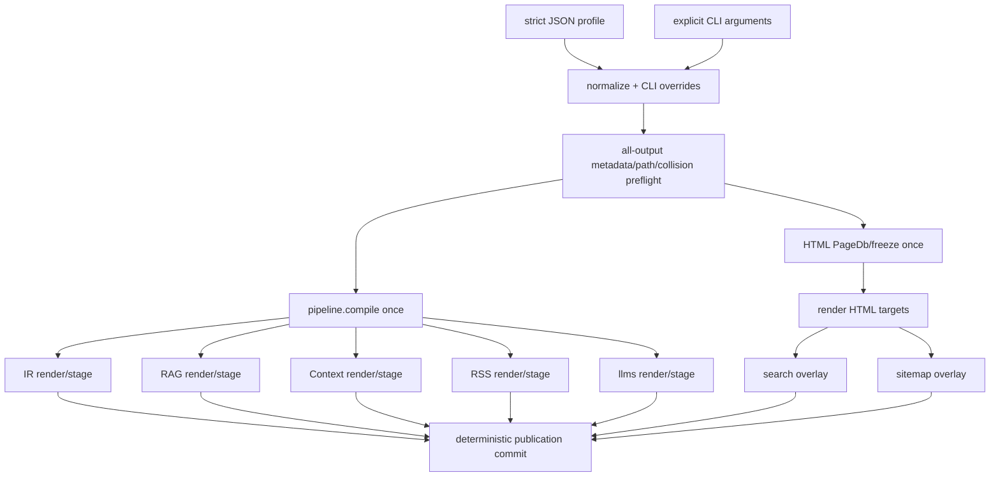

# Canonical publication profile

Status: proposal; non-normative until contracts and implementation land

Date: 2026-07-29

Evidence base:
[`../audits/publication-surface.md`](../audits/publication-surface.md)

## Decision

Add an explicitly selected, strict JSON publication profile that normalizes to
one immutable `PublicationPlan`.

The first shipped syntax should be:

```text
boris build --profile boris.publication.json
```

There is no automatic profile discovery in v1. Without `--profile`, the CLI,
defaults, conflicts, paths, artifact bytes, and exit behavior remain unchanged.

The profile coordinates:

- one or more HTML targets;
- the automatic rendered-search artifact for every HTML target;
- optional RSS, sitemap, and llms.txt files owned by one public HTML target;
- optional project-level JSON IR, RAG, and Context editions.

It records site URL, title, and description once. It does not add a general
configuration language, change frontmatter, fetch remote resources, load
plugins, or make analysis commands publish.

The implementation should initially share one `pipeline.Result` among the
machine exporters while continuing to use the existing HTML
`PageDb`/`FrozenSite` path. HTML/IR graph unification is deliberately deferred
until explicit equivalence tests make it safe.

## Goals

1. Represent one complete, deterministic publication as an explicit set of
   human and machine outputs.
2. Remove repeated deployment metadata from normal project invocations.
3. Validate every selected output and cross-output path before publishing.
4. Build all coordinated pipeline-based editions from one immutable compile
   result and one source revision.
5. Preserve the existing HTML multi-target sharing and isolated target model.
6. Keep every existing CLI flag usable; allow CLI values to override profile
   values without hidden precedence.
7. Preserve current artifact schemas until their contracts are deliberately
   amended.
8. Keep the profile grammar small, closed, bounded, offline, and implementable
   in Zig `std`.

## Non-goals

- YAML, TOML, arbitrary expressions, environment interpolation, includes, or a
  general task runner;
- remote deployment, upload, URL probing, feed submission, or sitemap pinging;
- an extension/plugin registry;
- changing author frontmatter or Trunk/Satellite graph semantics;
- replacing Apex, the Zig build, themes, or layouts;
- making `check` or `impact` produce publication artifacts;
- absorbing migration labs or source-RAG into the product compiler;
- promising a single graph representation before equivalence is proven;
- Atom, JSON Feed, `robots.txt`, sitemap indexes, `llms-full.txt`, or new export
  formats;
- broad watch-mode orchestration in the first slice.

## Constraints preserved

| Constraint | Design consequence |
|---|---|
| No Node or JavaScript application layer | Parsing, validation, normalization, coordination, and emission remain Zig code |
| No general YAML configuration | One strict, versioned JSON schema; no aliases or implicit coercion |
| No removal of existing flags | Legacy invocations keep their current parser and semantics |
| CLI can override project configuration | Explicit arguments are applied after profile normalization; ambiguous overrides fail |
| No hidden network access | URLs are validated as strings only; profile loading is local filesystem I/O |
| Deterministic output | Objects normalize to typed fields; named collections and layout rules use the existing canonical ordering |
| Existing contracts authoritative | Coordination preserves current artifact bytes unless a named contract change says otherwise |
| Analysis remains read-only | `check` and `impact` reject `--profile` in v1 and never execute publication entries |
| Labs remain separate | Profile schema has no lab, migration, or source-RAG fields |
| `content/` is a product artifact | Integration and hostile tests use both focused fixtures and the checked-in public content tree |

## Design alternatives

### Option A: no file, composable CLI only

Example:

```text
boris build --html-dir dist --sitemap --rss --llms \
  --site-url https://docs.example.test/ \
  --rss-title "Example Docs" \
  --rss-description "Product documentation" \
  --out .boris --rag-dir rag --context-dir context
```

Advantages:

- no parser or new on-disk format;
- flags remain the only configuration model;
- easy for one-off use and generated CI commands.

Costs:

- long invocations repeat metadata and output intent;
- quoting and repeated target/layout rules are fragile across shells;
- no reviewed project artifact states what a complete publication contains;
- cross-output validation still requires a canonical plan internally;
- adding “disable,” “only,” or per-output scope flags expands an already dense
  CLI grammar;
- the same project intent must be duplicated across local scripts and CI.

Assessment: useful as an implementation capability and override layer, but not
a sufficient canonical project representation.

### Option B: small Boris-specific grammar

Example:

```text
publication 1
input content
site https://docs.example.test/ "Example Docs" "Product documentation"
target public dist theme themes/boris
target public sitemap sitemap.xml
target public rss rss.xml limit 20
edition ir .boris
edition rag rag
```

Advantages:

- closed vocabulary and concise syntax;
- comments and domain-specific errors could be pleasant;
- no third-party runtime.

Costs:

- Boris would need to own tokenization, quoting, escaping, duplicate handling,
  source locations, fuzzing, and version migration for another language;
- nested layout rules and output options quickly turn the “small” grammar into
  a general config parser;
- schema tooling and fixture validation would be bespoke;
- it adds a second closed author grammar beside frontmatter without product
  evidence that a custom language improves publication behavior.

Assessment: technically consistent with a Zig-only product, but more parser
surface than this problem requires.

### Option C: strict JSON project manifest

Advantages:

- Zig `std` already supports JSON parsing; no product runtime is added;
- the repository already treats strict JSON schemas, duplicate/unknown fields,
  bounded parsing, and deterministic JSON as normal compiler work;
- nested targets, layout rules, and independently optional editions are
  unambiguous;
- a `format` discriminator and `schema_version` give explicit evolution;
- editors and CI can validate a checked-in artifact without executing Boris;
- JSON has no native comments, anchors, tags, or environment expansion to
  accidentally become a general configuration language.

Costs:

- hand-authored JSON is noisier than a purpose-built grammar;
- duplicate-key rejection must be explicit rather than delegated to a
  permissive decoded object;
- paths and cross-field requirements still need Boris-specific validation;
- users cannot annotate the file with comments.

Assessment: recommended. It creates the least new semantic machinery while
remaining durable and reviewable.

### Option D: checked-in `build.zig` publication wrapper

The repository already uses Zig's build system, so a project could encode
repeated Boris arguments in a custom build step.

Advantages:

- no new data grammar;
- can express arbitrary local build orchestration;
- repository-consistent for Boris contributors.

Costs:

- publication intent becomes executable build code rather than bounded data;
- projects using a distributed Boris binary would need a Zig build project;
- validation, diagnostics, and tooling cannot inspect intent without running
  the build;
- arbitrary code defeats the “closed, offline, deterministic project input”
  boundary;
- it couples ordinary documentation authors to compiler build mechanics.

Assessment: acceptable as an external wrapper, not a canonical Boris product
layer.

## Proposed schema

File name is conventional only; v1 requires an explicit path:

```json
{
  "format": "boris-publication-profile",
  "schema_version": 1,
  "input": "content",
  "site": {
    "url": "https://docs.example.test/",
    "title": "Example documentation",
    "description": "Reference and guides for Example."
  },
  "targets": [
    {
      "name": "public",
      "output": "dist",
      "public": true,
      "theme": "themes/boris",
      "layout_rules": [
        {
          "selector": "glob:guides/**",
          "layout": "themes/boris/layouts/guide.html"
        }
      ],
      "sitemap": {
        "path": "sitemap.xml"
      },
      "rss": {
        "path": "rss.xml",
        "limit": 20
      },
      "llms": {
        "path": "llms.txt"
      }
    },
    {
      "name": "preview",
      "output": "dist-preview",
      "layout": "themes/boris/layouts/main.html"
    }
  ],
  "editions": {
    "ir": {
      "output": ".boris"
    },
    "rag": {
      "output": "rag",
      "split_size": 200000
    },
    "context": {
      "output": "context",
      "scope": "guides/"
    }
  }
}
```

This example is proposed syntax, not accepted by the current executable.

### Top-level fields

| Field | Required | Semantics |
|---|---|---|
| `format` | Yes | Must equal `boris-publication-profile` exactly |
| `schema_version` | Yes | Integer `1`; independent from IR schema versions |
| `input` | No | Workspace-relative content root; current default `content` |
| `site` | Conditional | Publication metadata required by RSS/sitemap; otherwise optional and inert |
| `targets` | No | HTML targets; omission means the profile has no HTML publication |
| `editions` | No | Optional project-level machine editions |

At least one target-owned output or machine edition must be enabled. Unknown
fields are errors at every object level.

### Site metadata

`site.url` uses the current RSS/sitemap HTTP(S) validation and canonical URL
joining. `site.title` and `site.description` use the current RSS channel
validation and limits.

In schema v1:

- `site.url` feeds RSS and sitemap only;
- `site.title` and `site.description` feed RSS only;
- HTML layouts do not receive new variables;
- llms.txt does not change its fixed heading or link model;
- IR, RAG, Context, and search bytes do not change because `site` exists.

This narrow rule prevents a coordination feature from silently changing
unrelated artifact contracts.

### HTML targets

Targets reuse the canonical model already defined by the multi-target and theme
contracts:

- target names are unique and sort canonically;
- output roots are workspace-relative, non-overlapping, and isolated;
- exactly one of `theme` or `layout` may be present;
- a theme is sugar for its existing main layout and managed asset root;
- `layout_rules` reuse the exact `id:`, `glob:`, and `role:` selector grammar,
  canonical ordering, precedence, and 256-rule limit;
- target output, layout, theme root, content root, and machine-edition paths are
  checked together for overlap and symlink escape.

Execution controls such as `jobs`, `incremental`, `watch`, and `quiet` do not
belong to the publication identity in v1. They remain CLI controls and must not
change artifact bytes.

### Public target

At most one target may set `"public": true`.

RSS, sitemap, and llms.txt are allowed only inside that public target in schema
v1:

- their paths are relative to the target root;
- RSS and sitemap require `site`;
- RSS also requires non-empty site title and description;
- sitemap uses site URL and the target's emitted page paths;
- llms.txt remains byte-compatible with its current standalone contract;
- search is always planned automatically for every HTML target at its fixed
  path and has no enable/disable field.

This removes the current ambiguity between a public URL and multiple target
roots. It also places deploy-facing files beside the HTML they describe.
Multiple independently public deployments, locales, or hostnames require a
future schema version rather than an overloaded v1 field.

### Project-level machine editions

`editions` is a closed object with optional `ir`, `rag`, and `context` fields.
Each has an explicit workspace-relative output root.

- IR has no format-specific options in v1.
- RAG may use its current `scope`, `split_size`, and `bundles_only` controls.
- Context may use its current `scope` and `split_size` controls.
- Scope validation and artifact formats remain those of the existing
  exporters.

These paths may not overlap content, layouts, target roots, each other, or
compiler-owned staging/cache paths. Disallowing a machine-edition root inside
an HTML target in v1 avoids two independent publishers owning the same tree.

## Canonical in-memory model

JSON and CLI arguments both project into a typed, immutable plan:

```text
PublicationPlan
  input: ValidatedPath
  site: ?SiteMetadata
  html_targets: []HtmlTargetPlan
    automatic_search: true
    sitemap: ?SitemapPlan
    rss: ?RssPlan
    llms: ?LlmsPlan
  ir: ?IrPlan
  rag: ?RagPlan
  context: ?ContextPlan
  execution: ExecutionOptions
```

The source syntax must not leak beyond plan construction. The coordinator and
emitters receive validated typed values, not raw JSON keys or argv strings.

Normalization rules:

1. validate the profile discriminator/version and reject duplicate or unknown
   keys;
2. validate bounded strings, counts, URLs, integers, selectors, and paths;
3. sort targets by name and layout rules by the existing canonical key;
4. derive theme layouts/assets using current rules;
5. add the fixed automatic-search plan entry to each HTML target;
6. apply explicit CLI overrides;
7. re-run all cross-field and cross-output validation;
8. freeze the plan before discovery, compilation, or output staging.

The manifest object's textual key order has no semantic effect.

## CLI behavior and precedence

### Compatibility boundary

No profile:

- parser behavior is exactly the current behavior;
- mutually exclusive output modes stay mutually exclusive;
- current defaults and paths stay unchanged;
- current help examples remain valid;
- no file named `boris.publication.json` is discovered automatically.

With `--profile PATH`:

- `build` or the bare command executes the complete normalized profile;
- existing output flags become explicit enable/override inputs to the plan
  rather than mutually-exclusive dispatcher modes;
- `watch`, `check`, and `impact` reject `--profile` in v1 with exit 2;
- help labels proposed/profile behavior separately from legacy behavior.

This context-dependent composition does not break an existing invocation,
because `--profile` is new and explicit.

### Precedence

From lowest to highest:

1. compiled Boris defaults;
2. values in the selected profile;
3. explicit CLI arguments.

“Explicit” must be tracked by the parser. A default-filled field in the current
`cli.Options` structure is not an override merely because it has a value.

Examples:

- `--input docs` replaces profile `input`.
- `--site-url URL`, `--rss-title`, `--rss-description`, and `--rss-limit`
  replace corresponding profile values.
- `--rag-dir out/rag` enables RAG if absent and replaces its output if present.
- `--context-dir`, `--out`, `--llms-path`, `--rss-path`, and
  `--sitemap-path` similarly enable/replace their named plan entry.
- `--target public=release` replaces the output root of the named target or
  adds a target when the name is new.
- `--target-layout` and `--layout-rule` apply by target name using current
  canonicalization.
- `--html-dir DIR` is valid only when the resulting plan has one HTML target;
  otherwise it is an ambiguity error that names the targets.
- `--theme` and global `--html-layout` are valid only when they resolve to one
  target; multi-target ambiguity remains an error.
- `--jobs`, `--incremental`, and `--quiet` affect execution only.

An override cannot weaken validation. Changing a target root or public URL
causes all collision, containment, and cross-field checks to run again.

### Selecting a subset

The first profile slice does not add a generic negative/disable syntax.
Operators needing one legacy output can continue to run the existing command
without `--profile`.

A later `--only <output>` may be designed if CI evidence shows a real need, but
v1 should not overload `--rss` or `--rag` to mean both “enable” and “disable
everything else.” With a profile, existing output selectors only enable or
override their output; the checked-in profile remains the canonical complete
publication.

## Planning, compilation, and publication



The diagram is a target architecture, not current behavior.

### Safe initial reuse

Refactor each pipeline-based exporter into:

1. its current standalone wrapper, which compiles and calls the renderer; and
2. a renderer/stager that accepts `*const pipeline.Result` and explicit output
   options.

The profile coordinator compiles that result once and lends it immutably to IR,
RAG, Context, RSS, and llms.txt. Existing wrappers remain for legacy CLI modes
and must produce identical bytes.

RAG and Context may still read their documented local seed/source material.
Sharing the graph does not authorize network access or shared mutable output
state.

### HTML boundary

Keep the existing HTML multi-target compiler intact at first. It already:

- shares discovery, promotion, graph freeze, include state, and fingerprints;
- renders target jobs with bounded workers;
- creates a complete staged/live overlay for search and sitemap;
- commits each target through established ownership and rollback rules.

Do not replace it with `pipeline.Result` merely to claim “compile once.”
First add a fixture-driven equivalence harness covering entity inclusion,
status handling, parent/child edges, semantic relations, deterministic order,
diagnostic identity, include dependencies, route mapping, and role promotion.

### Commit semantics

Current output families have independent staging/commit implementations. A
profile must not claim all-output atomicity until the coordinator can prove it.

Before the profile is called stable:

1. validate the complete plan before content discovery;
2. compile and render every selected output to private staging paths before
   replacing any prior successful output;
3. preserve all prior successful outputs on validation or rendering failure;
4. preflight cross-device and symlink constraints;
5. commit in one documented deterministic order;
6. test failures at each commit boundary.

A true atomic rename across multiple unrelated roots is not portable. Schema v1
should therefore promise **prior-output preservation before commit** and a
deterministic, recoverable commit protocol, not filesystem-wide atomicity.
Publishing a final provenance/receipt artifact can be considered after the
commit protocol is designed; it is not invented by this proposal.

## Implementation slices

Each slice is independently reviewable and must keep legacy gates green.

### Slice 1: plan parser and normalization

- Add `src/publication_profile.zig` with bounded strict JSON parsing.
- Detect duplicate keys before object materialization.
- Define `PublicationPlan` and path/metadata/collision preflight.
- Add `--profile PATH` parsing, explicit-value tracking, help, and diagnostics.
- Keep execution behind tests or reject it until all enabled outputs can stage
  safely; do not ship a partially honored profile.
- Add the normative profile contract and JSON schema fixture.

### Slice 2: reusable machine renderers

- Split compile-owning wrappers from borrowed-result render/stage functions for
  IR, RAG, Context, RSS, and llms.txt.
- Compile one immutable pipeline result in the coordinator.
- Compare every legacy artifact tree with its profile-produced counterpart.
- Preserve exporter-specific validation, status rules, and exit classes.

### Slice 3: target-owned publication files

- Add profile-owned RSS and llms.txt paths inside the public target.
- Reuse the existing sitemap/search target overlay rules.
- Preflight collisions with pages, assets, cache, staging, and each other.
- Expose no new template variables or discovery tags in this slice.

### Slice 4: coordinated staging and commit

- Extract stage/validate/commit boundaries without weakening existing rollback.
- Render all selected families before the first replacement.
- Define deterministic commit and failure-recovery semantics in contract.
- Add hostile failures for every publisher and commit position.

### Slice 5: release and public documentation

- Add the full-profile release-gate smoke and determinism comparison.
- Update focused contracts and `docs/STATUS.md`.
- Add one changelog fragment.
- Perform the later `content/` corrections and dogfood pass identified by the
  audit.
- Make only focused README changes after behavior is shipped.

### Deliberate later slice: graph convergence

- Run the HTML/pipeline equivalence corpus first.
- Decide whether one representation can supply both contracts without losing
  render/include/layout state.
- Change module ownership only with measured memory/time evidence and no
  diagnostic or artifact drift.

This is not required to deliver the publication profile.

## Contract work

When implementation begins:

1. Add `docs/contracts/publication-profile.md` as the normative schema,
   precedence, validation, offline, planning, and commit contract.
2. Amend `cli.md` to distinguish legacy single-mode behavior from explicit
   profile composition.
3. Amend `html-output.md` and `multi-target-isolated-output.md` for
   target-owned RSS/llms files and coordinated staging.
4. Amend `rss-2.0.md` and `xml-sitemap.md` to define profile metadata/path
   sources while preserving standalone CLI behavior.
5. Amend `llms-txt.md` only for target-relative profile placement. Do not
   change heading or URL semantics in that amendment.
6. Amend `ir-schema.md`, `rag-export.md`, and `context-bundle.md` only to state
   that a shared frozen compile result may drive identical standalone-format
   artifacts.
7. Add acceptance fixtures for a complete publication and invalid profiles.

No IR `schemaVersion` bump is required for coordination alone. A bump is
required only if the IR artifact shape changes.

## Test plan

### Parser and hostile profile tests

- missing/wrong `format` and `schema_version`;
- duplicate keys at every nesting level;
- unknown fields and near-miss spellings;
- invalid UTF-8, embedded NULs, empty/over-limit strings, deep nesting, huge
  arrays, and integer overflow;
- absolute paths, `..`, workspace escape, content/layout/output overlap,
  symlink escape, and reserved staging/cache paths;
- duplicate target names, duplicate edition definitions, multiple public
  targets, and public artifacts on a non-public target;
- missing URL/title/description for RSS and missing URL for sitemap;
- invalid URL schemes, control characters, RSS limits, and split sizes;
- theme/layout conflict, mixed theme roots, invalid selectors, duplicate rules,
  and rule-count limits;
- overlapping HTML targets and project edition roots;
- proof that parsing performs no environment expansion, command execution, or
  network access.

### Precedence tests

- compiled default versus profile versus explicit CLI for every field;
- distinguish an omitted flag from its current default-filled value;
- keyed target replacement independent of argv/profile order;
- canonical layout rules after mixed profile/CLI additions;
- ambiguity errors for global HTML overrides with multiple targets;
- revalidation after an override creates a path or metadata conflict;
- profile output selectors enable/override without silently removing configured
  outputs;
- unchanged legacy conflict behavior when `--profile` is absent.

### Integration tests

- one profile over a focused fixture produces HTML, automatic search, sitemap,
  RSS, llms.txt, IR, RAG, and Context at specified paths;
- the same profile over `content/` demonstrates the repository's real public
  artifact, including an explicit assertion about current zero-item RSS until
  dogfood metadata is added;
- public plus preview targets: search on both, public files only on public;
- legacy standalone versus profile artifact-tree byte equality for every
  exporter;
- repeated profile runs are byte-identical;
- HTML `--jobs 1` versus `--jobs 4` and a repeated parallel run are identical;
- sequential target order and permuted manifest object order are identical;
- invalid graph, missing include/layout, RSS metadata failure, sitemap limit,
  output collision, and emitter I/O failure preserve every prior successful
  output;
- injected failure at each deterministic commit position exercises recovery;
- `check` and `impact` create no publication artifacts and reject profiles;
- migration labs and source-RAG build/tests remain independent.

### Graph-equivalence tests before convergence

Use the same hostile graph fixtures through pipeline IR and HTML freeze:

- identical entity ID set and canonical order;
- identical parent/child edges and role promotion;
- identical semantic relation acceptance/rejection;
- explicit, contract-supported status differences rather than accidental ones;
- identical cycle, unknown-parent, duplicate-ID, and malformed-frontmatter
  diagnostics where contracts overlap;
- include dependencies and route mapping accounted for as HTML-only state.

Passing a small happy-path fixture is not enough to authorize unification.

### Release-gate additions

- focused profile parser/schema step;
- full-profile black-box artifact inventory;
- dual-run and parallel-run byte comparison;
- legacy/profile equivalence comparison;
- prior-output-preservation hostile case;
- public/preview target ownership check;
- analysis no-artifact check with profile rejection.

## Risks

| Risk | Mitigation |
|---|---|
| A profile becomes a general config language | Closed JSON schema, unknown-key rejection, no expressions/includes/env, versioned review |
| “One invocation” is mistaken for one graph | Document the two graph families; share only `pipeline.Result` initially; add equivalence gates |
| Cross-output writes leave a mixed generation | Stage before commit, deterministic recoverable protocol, failure injection; do not claim global atomic rename |
| CLI precedence becomes surprising | Track explicit flags, publish a field-by-field table, reject ambiguous global overrides |
| Paths from independent publishers collide | Normalize all ownership into one preflight before discovery or writes |
| Public metadata silently changes artifact bytes | Limit v1 consumers; require contract amendments for HTML/llms behavior |
| Multiple targets imply multiple deployment URLs | Permit exactly one public target in v1; version the schema for multi-site needs |
| Watch multiplies expensive exports | Reject profile watch initially; design invalidation/output cadence later |
| Content docs claim proposal syntax too early | Keep raw design under `docs/`; update `content/` only after implementation and tests |

## Deliberately deferred

- automatic profile discovery and default filename semantics;
- generic `--only`/disable expressions;
- profile-aware watch and incremental machine-edition rebuilds;
- multiple public hosts, locales, feed sets, or sitemap indexes;
- feed/sitemap tags injected into layouts;
- site-aware llms headings and route-correct absolute URLs;
- HTML metadata/template variables sourced from `site`;
- all-target or all-root filesystem atomicity;
- remote publishing, credentials, secrets, environment substitution, and URL
  reachability checks;
- new formats, plugin outputs, migration labs, and source-RAG entries;
- graph-representation unification without equivalence evidence.

## Acceptance criteria for the first stable profile

The profile is stable only when:

- a strict schema and normative contract exist;
- no-profile invocations are behavior- and byte-compatible;
- one checked-in profile can plan every requested output;
- site metadata appears once and current RSS/sitemap validation is preserved;
- search remains automatic for every HTML target;
- all paths and collisions are rejected before publishing;
- machine exporters share one immutable pipeline result;
- HTML retains its tested multi-target sharing;
- selected outputs stage successfully before prior outputs are replaced;
- deterministic, hostile, parallel, legacy-equivalence, and analysis-boundary
  gates pass;
- public `content/` and focused README prose are updated only after those
  behaviors ship.
