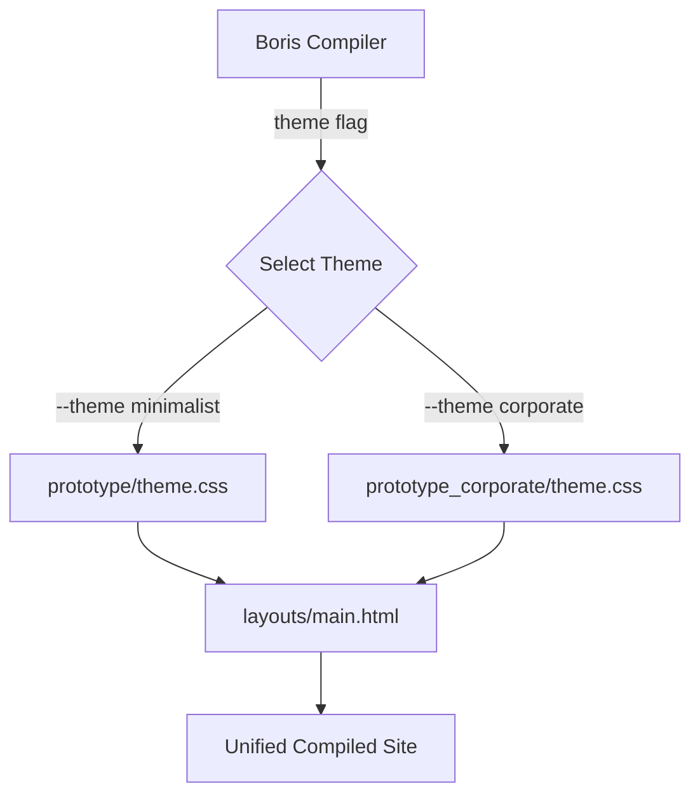

# Boris Default Theme Family Strategy & Recommendation Report

This report presents a technical evaluation and strategic recommendation comparing the two successfully calibrated static-site themes:
1. **Minimalist Milligram Theme** (Stitch Project `1061322645115415276`)
2. **Modern Corporate Theme** (Stitch Project `9485581018269572800`)

Both themes have been verified to compile **40/40 identical documentation pages recursively** with **100% byte-for-byte determinism** and **zero CDNs, external scripts, or external font-face network dependencies**.

---

## 1. Core Structural Commonalities & Layout Portability

During calibration, we discovered an incredibly valuable architectural pattern: **the HTML layout tree can be unified and shared across both themes.**

Both designs implement the exact same semantic responsive layout containers:
- A horizontal `.header` tracking top navigation links and action items.
- A vertical `.sidebar` tracking hierarchical site-nav lists (`{{nav}}`) wrapped in collapsible mobile accordions.
- A central `.content-area` main wrapper containing breadcrumbs, semantic markdown headings (`<h1>`, `<h2>`), body text, bento card blocks, code blocks, and the dynamic `{{footer}}`.
- A right-hand `.toc-sidebar` mapping headings of the current document (`{{toc}}`).

Because we mapped both themes to this clean, semantic class architecture, **themes are 100% hot-swappable at compilation runtime simply by switching `assets/theme.css`!** This provides the Boris engine with a world-class, zero-redundancy theme family model.

---

## 2. Aesthetic & Architectural Contrast

While sharing the same semantic HTML layout tree, the two themes express entirely different design languages:

| Design Dimension | Minimalist Milligram (`prototype/`) | Modern Corporate (`prototype_corporate/`) |
| :--- | :--- | :--- |
| **Shape Language** | **Flat, ultra-sharp geometry:** `border-radius: 0px` strictly enforced. | **Organic, rounded geometry:** `border-radius: 4px` on buttons, `8px` on cards, `9999px` on inputs. |
| **Elevation & Depth** | **Flat / Solid:** Zero box-shadows. Flat border separators (`1px solid #e1e1e1`) define sections. | **Layered / Soft Depth:** Floating shadows (`0 1px 3px rgba(0,0,0,0.1)`) give card boxes a modern elevated stack. |
| **Tone & Canvas** | **Warm & Compact:** Features desaturated soft pink-grey background elements and deep charcoal texts. | **Brilliant & Off-White:** Features a neutral off-white workspace canvas (`#f8f9fb`) and pure white containers (`#ffffff`). |
| **Primary Accent Color** | **Deep Teal:** Hex `#00535b`. High contrast, highly legible, retro-modern look. | **Corporate Blue:** Hex `#003d9b`. Reassuring, sleek, enterprise-grade aesthetic. |
| **Typography Focus** | **Compact & Condensed:** Emphasizes tight line heights, great for high information density text. | **Generous & Rounded:** Emphasizes breathing room and modern body text readability. |

---

## 3. Structural Recommendation for Boris Core

To establish a premium out-of-the-box user experience, we recommend shipping **both themes as the "Boris Default Theme Family"** using a simple theme-select flag.

### Shipping Architecture

### Strategic Recommendations

1. **Keep the Layout Unified:** Do not ship separate layout HTML templates. Maintain a single, standard `layouts/main.html` layout that uses clean semantic classes.
2. **Expose the Theme CSS Assets:** Ship both `assets/minimalist.css` and `assets/corporate.css`. Users can select between them by copying the chosen stylesheet to `assets/theme.css` or supplying a theme configuration flag in Boris's CLI.
3. **Establish a Neutral CSS Variable Layer:** Define a common set of theme-token variables in `main.html`'s stylesheet inclusion, making it trivial for users to customize radii, accents, and spacing without altering core stylesheets.

By leveraging this zero-dependency, CSS-variable-driven theme architecture, Boris can offer world-class, highly aesthetic corporate and minimalist outputs with absolutely zero compilation overhead or software bloat.
