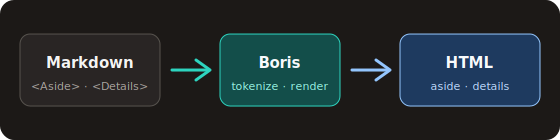

# Components

Boris supports a **closed** component set. This page dogfoods the ones themes
need to style: Aside callouts and native Details disclosures, plus a
page-local image from the sibling `.assets/` tree.

## Aside callouts

Asides stay in document order. They are not graph nodes and not standalone
pages.

<Aside kind="tip">

Prefer short, actionable callouts. Long asides bury the reading line.

</Aside>

<Aside kind="info">

Kinds are allowlisted: `note`, `tip`, `info`, `warning`, `danger`.

</Aside>

<Aside kind="warning">

Unknown PascalCase tags fail the build (`ECOMPONENT`). There is no free-form
component registry.

</Aside>

## Details disclosure

Details maps to the platform-native disclosure element. The summary is plain
escaped text (not Markdown). The body is ordinary Markdown.

Use **Aside** for always-visible callouts (tips, warnings). Use **Details**
when the content is optional depth—FAQ answers, long digressions, or
progressive disclosure that should stay collapsed by default.

You may set open to true when the disclosure should start expanded.

Native HTML details and summary elements are keyboard operable. This theme
styles the summary with a visible focus ring and a reduced-motion-friendly
open marker. Do not replace the native control with a JavaScript accordion.

## Page-local figure

The figure is stored at `guides/components.assets/component-flow.svg` next to
this page. Boris publishes it to `guides/components.assets/` in the target
output and rewrites the Markdown image destination to a page-relative URL.

## Theme styling hooks

| Emitted class | Source |
|---------------|--------|
| `.admonition`, `.admonition--tip`, … | Aside HTML |
| `.details`, `.details__body` | Details HTML |
| `.site-nav`, `.page-toc`, `.page-children` | layout slots |

Style those classes in theme CSS. Do not invent a second template language.
