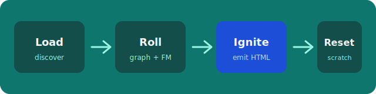

# A calm documentation surface

This optional example is a **polished reference theme** for Boris sites. It
stays inside the closed product surface: Markdown content, Trunk/Satellite
graph, layout slots, theme assets, closed components, and page-local
`.assets/` images.

| Surface | Where it shows up |
|---------|-------------------|
| Theme CSS + mark | `theme/assets/` via `{{asset-url …}}` |
| Site forest | Home `{{nav}}` card |
| Direct children | Section landings via `{{children}}` |
| Layout selection | `--layout-rule` picks home / section / main |
| Page-local figure | Image below, from `index.assets/` |

## Teaching rhythm

The diagram is a **page-local asset**: it lives next to this page in
`index.assets/`, is published beside the HTML, and is rewritten to a
page-relative URL. Theme `assets/` remain separate under the target `assets/`
prefix.

## Start here

1. [Guides](guides.md) — authoring walkthrough and components
2. [Reference](reference.md) — slots, layout rules, and theme boundaries

<Aside kind="tip">

This tree is not product chrome. Boris does not ship a default marketing theme.
Copy patterns from this example; keep your own brand and CSS.

</Aside>
