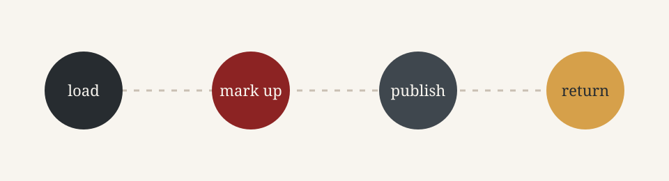

# A considered publishing surface

This is the Boris-native Textpattern theme: a translation of the classic
Textpattern visual language into a static graph of Markdown pages. It keeps
the good constraints—paper, typography, visible links, and a little room for
the text to breathe—while letting Boris own navigation, breadcrumbs, outlines,
metadata, and page relationships.

## Start with the shape of the site

| Section | What it holds |
| --- | --- |
| [Guides](guides.md) | Authoring and component notes |
| [Reference](reference.md) | The closed theme surface and slot map |
| [Journal](blog.md) | Short field reports about the port |
| [Archive](archive.md) | Stable, numbered entries for long-lived material |

The page tree is the information architecture. The stylesheet gives it a
voice; it does not have to re-create a CMS control panel to feel like a
publishing system.

<Aside kind="tip">

The theme uses no remote font, framework, JavaScript, or network image. A
browser can open the generated directory as a quiet, self-contained site.

</Aside>

## A deliberately small contract

The layouts use the slots Boris already owns. Everything around those slots is
ordinary semantic HTML and local CSS. That makes the port easy to replace or
carry into a codeless theme contribution later.

The original reference files have a useful editorial tension: strong headers,
modest controls, and enough whitespace for long prose. This port keeps that
relationship while adding responsive stacking, native disclosure, and the
graph-backed page map expected by Boris.

